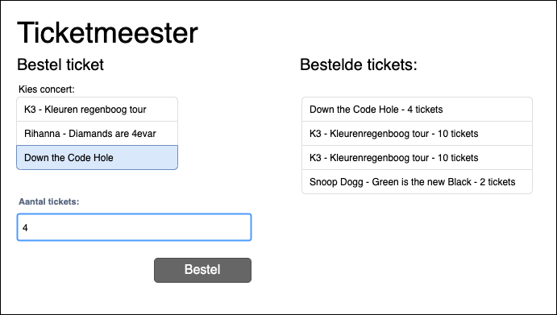

# Training - List - Ticketmeester

Je werkt als software developer bij het bekende bedrijf "Ticketmeester". Bij Ticketmeester worden online concerttickets verkocht voor uitlopende concerten. 

Maak een applicatie waar de koper tickets kan kopen voor een concert. 
Laat in een overzicht zien welke tickets er zijn verkocht. Deze tickets moeten op alfabet gesorteerd zijn. Maak gebruik van een List waar strings inzitten. 

## Uitbreidingen
- Voeg er een knop aan toe waar de gebruiker zijn tickets kan sorteren op alfabet ascending en descending.
- Voeg een extra veld toe zodat de gebruiker kan kiezen voor een sta- of zitplaats.
- Voor de diehards: maak van de strings een losse ticket object. Hierdoor kan je meer gegevens gebruiken.

## Bronnen
- List Sort https://www.dotnetperls.com/sort
