# De Debugger
Activiteit: Kennismaken met de debugger van Visual Studio

## Inleiding 
Bij softwareontwikkeling nemen testen en fouten herstellen meer tijd in beslag dan het daadwerkelijk code schrijven. Met een debugger kun je geen fouten opsporen maar alleen lokaliseren. Een debugger bestaat uit een verzameling tools waarmee je `breakpoints` (stoppunten) kunt zetten, en waarmee je `stepping` (stap voor stap uitvoeren) kunt toepassen. Tevens kun je variabelen inspecteren en kun je de `call stack` en nog veel meer aspecten bekijken. 

## Opdracht 
In deze tutorial ga je een aantal mogelijkheden van de debugger onderzoeken. Maak een `Console Application` project aan. Noem het project "Debuggen". 

### DEBUG TOOLBAR 
Open in Visual Studio het menu `View` > `Toolbars`. Je krijgt dan alle toolbars die beschikbaar zijn voor de gebruiker te zien. Zorg dat `Debug` aangevinkt is. Dan krijg je de onderstaande toolbar. 

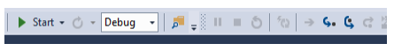

Het drop-down menu naast de `Breakpoints`-knop bevat de mogelijkheid om meer of minder buttons zichtbaar te laten zijn in de toolbar. Vink bijvoorbeeld “Show/Hide Thread ” uit. 

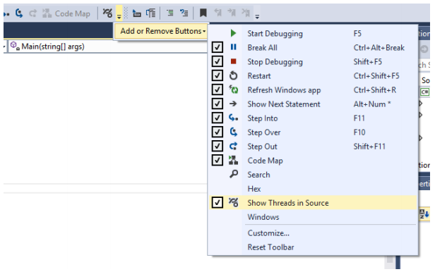


Zoals je ziet zijn ook de sneltoetsen in dit menu weergegeven. Dubbelklik in de `Solution Explorer` van Visual Studio op "Program.cs" om dit bestand te openen. Je ziet dan de code van de `class` "Program" in de editor. 

Type de onderstaande code in de "Main"-method (tussen de accolades) 

```cs
string\[\] namen = { "naam1", "naam2","naam3", "naam4", "naam5", "naam6" }; 

foreach (string naam in namen) 
Console.WriteLine(naam); 
Console.ReadLine();
```

```Wat gebeurt er als deze code wordt uitgevoerd? Beschrijf het voordat je het programma uitvoert. 
```

Een druk op de `Start`-knop heeft hetzelfde effect als `F5`. De applicatie runt na een eventuele build. 

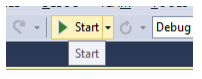

`Stop Debugging` stopt de debugger met runnen en gaat terug naar de ontwerpomgeving. 

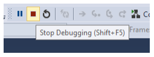

`Restart` is de herstart van de debugger vanaf het begin, alle variabelen worden gereset. 

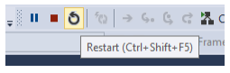


Ga met de cursor op de regel `Console.WriteLine(naam);` staan en druk op F9. Je ziet nu een `BreakPoint` in de kantlijn verschijnen (Het rode bolletje). 

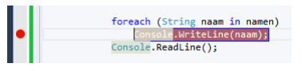

Als je nu het programma runt pauzeert het bij het `BreakPoint`. Deze regel wordt nog niet uitgevoerd. Je ziet dat de regel nu geel is gekleurd en een gele pijl wijst naar de regel die nog niet uitgevoerd is. 

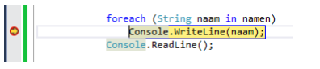

`Step Into` laat regel voor regel door de code stappen. Dit betekent dat je ook in een methode kunt gaan die worden aangeroepen. 

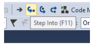

Stap met F11 door deze code heen. In het `Command Window` zie je het resultaat hiervan weergegeven. 

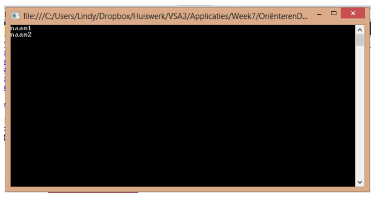


`Step Over` laat je ook stap voor stap door de code lopen maar gaat niet de methodes in. Dat is handig als je alleen het resultaat van een methode wilt zien. Dat kan is onze code niet bekeken worden, we roepen namelijk geen andere methode aan. 

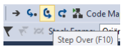

`Step Out` is handig als je niet langer door een methode wilt lopen. Dat heb je nodig als je in een systeemfunctie bent beland. Maar ook als je gewoon snel naar het volgende statement wilt kun je deze knop gebruiken. 


`Continue` is handig als je tijdens het debuggen gezien hebt wat je moet zien. Dus als je al gezien hebt dat het goed gaat. Als je op Continue klikt gaat de debugger naar het volgende breakpoint of naar het einde van het programma als er geen breakpoint meer is. 

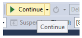


## Breakpoints 
`BreakPoints` zijn erg belangrijk bij debuggen. Je kunt een `BreakPoint` ook zetten door éénmaal op de grijze verticale balk aan de linkerkant van je scherm te klikken. 

`BreakPoints` opent het `BreakPoint Window` en integreert het samen met andere windows onderaan in de Visual Studio omgeving. Dit window bevat informatie over alle `BreakPoints` die op dit moment zijn gezet. 

Zet in je programma ook nog een `BreakPoint` op methodenaam "Main" en bekijk het `BreakPoints Window`. 

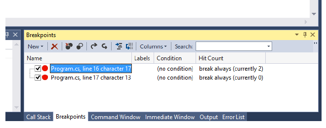


In het BreakPoints Window zie je dan weergegeven waar het breakpoint in je code staat. 

## MENU DEBUG 
Het Visual Studio Debugmenu bevat alle bovenstaande selecties voor degene die liever met menu's werken dan met toolbars. 

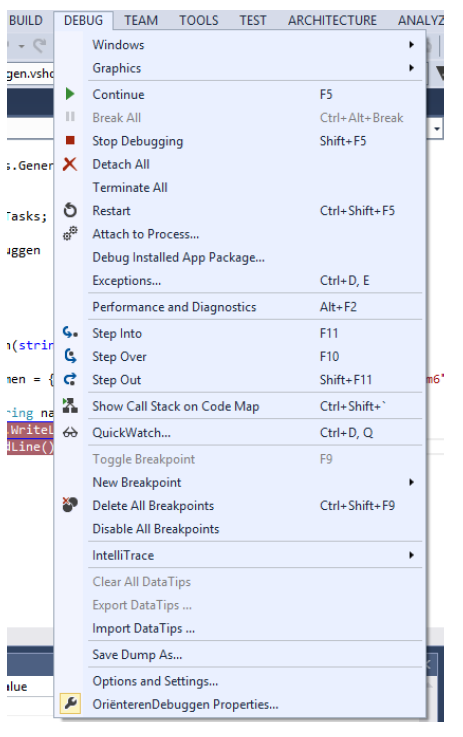


## WATCH WINDOWS 
Er is een aantal vensters tot je beschikking om de variabelen van het programma te bekijken. Tot nu toe zagen we het `BreakPoints Window` onderaan in de IDE weergegeven. Met het pijltje naast het icoon van de `BreakPoints` in de toolbar krijg een dropdownmenu met andere mogelijkheden. 

Maar ook komt dit menu als je kiest voor `Windows` onder `Debug`. 

```
Let op, je krijgt alleen alle mogelijkheden te zien als je bij een breakpoint staat. 
```

Er zijn verschillende soorten vensters zoals Autos, Local, etc. 

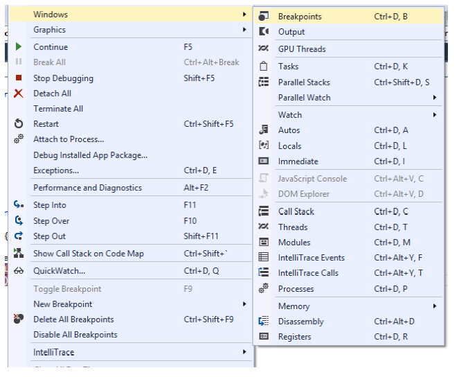

Als je programma pauzeert bij een `BreakPoint` kun je via zo’n venster bijvoorbeeld de waarden van het huidige object of variabelen inspecteren. Een mooie optie is ook de muis hover, als je over de variabele schuift met de cursor krijg je via een `ToolTip` ook de informatie van de variabele te zien. 

## LOCALS 
Dit scherm laat automatisch de lijst van variabelen zien die binnen de scope van een methode vallen. 


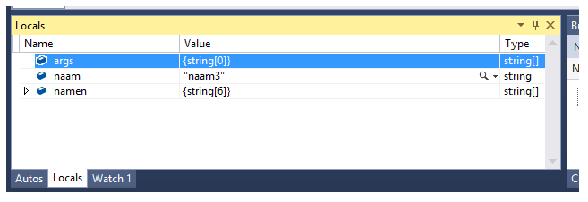


```
Wat gebeurt er als je de Hex knop van de Debugtoolbar indrukt?
```

## AUTOS 
In dit venster worden de variabelen weergeven waar de debugger staat en de variabelen in het statement wat ervoor staat. 

## WATCH 
In dit venster kun je zelf variabelen toevoegen die je wilt bekijken. Dit doe je door met je rechter muisknop te klikken op de variabele en dan “Add To Watch” te kiezen. Je kunt de variabelen ook naar het venster slepen. 

Om dit uit te proberen moet er wat code worden toegevoegd aan je programma. Vervang de regel `Console.ReadLine();` in de Main–methode door: 

```cs
int temp = 4; 
for (int i = 0; i < 10; i++) 
{ 
	if (i > 5) 
		temp = 5; 
		Console.WriteLine(temp); 
} 
Console.ReadLine(); 
```

```
Wat gebeurt er als deze code wordt uitgevoerd? Beschrijf het voordat je het programma runt.
```

Voeg de variabele `temp` toe aan het `Watch` scherm en volg de waarde van deze variabele terwijl je door de code heenloopt met de stepfunctie. 

## CALL STACK 
`Call Stack` informatie kan belangrijk zijn om te achterhalen hoe een programma in een bepaald stuk van de code terecht kwam. 

Als je meerdere methodes aangeroepen hebt en je wilt zien of de geneste methoden wel worden aangeroepen dan is de `Call Stack` nodig. 

Zet de onderstaande code in het programma buiten de Main-methode. Snap je hoe deze code werkt? 

```cs
public static void Methode1() 
{ 
	Console.WriteLine("Dit is methode1"); 
	Methode2(); 
} 

public static void Methode2() 
{ 
	Console.WriteLine("Dit is methode2"); 
	Methode3(); 
} 

public static void Methode3() 
{ 
	Console.WriteLine("En dit is methode3"); 
	Console.ReadLine(); 
} 
```

Vervang alle code in `Main`–methode (dus tussen de accolade) door een aanroep van Methode1. Dus door de code `Methode1();` 

Je hebt nu geneste methodenaanroepen gemaakt. `Methode1` wordt aangeroepen in de `Main`-methode. Dan roept `Methode1` na een `WriteLine`-statement `Methode2` aan. De `Methode2` roept op zijn beurt na een `WriteLine`-statement `Methode3` aan. `Methode3` heeft eerst een `WriteLine`-statement en wacht dan tot dat er een toets wordt in gedrukt. 

De `Call Stack` laat tot een `BreakPoint` de nesting zien. Zet een `BreakPoint` bij de aanroep van `Methode1` en loop met de debugger door de code en bekijk hoe de `Call Stack` de aanroepen laat zien. 

Als je in de `Call Stack` op een rij klikt, zie je in de code de bijbehorende code groen kleuren. 

Wen je zelf eraan om gebruik te maken van de debugger. Op de duur kost het minder tijd om fouten op te sporen. 


+ Versie 1-6-2015 Marcel Veldhuijzen (KAL, week 5, OIS11) 
+ Versie 25-1-2015 Marcel Veldhuijzen (Canvas) 
+ Versie 2014-02-18 Bas Michielsen 2012


