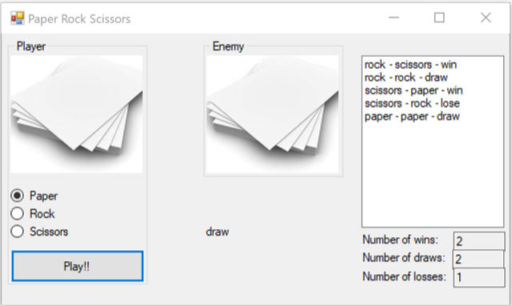

# Training Rock Paper Scissors

Maak het spel "paper rock scissors" (Steen Papier Schaar).

Dat kan in een WinForm-app (zoals in de omschrijving hieronder) maar mag ook op de Console of nog anders.

Doormiddel van radiobuttons kan je kiezen of je kiest voor paper, rock of scissors. Wanneer je erna op de "Play" button klikt wordt er automatisch voor de tegenstander een paper, rock of scissor gekozen. Daarna wordt er gekeken wie de winnaar is. De uitslagen (draw, win of lose) worden in een listbox gezet en wordt bijgehouden hoe vaak je draw, win of lose hebt. Dit zet je in textboxen.

