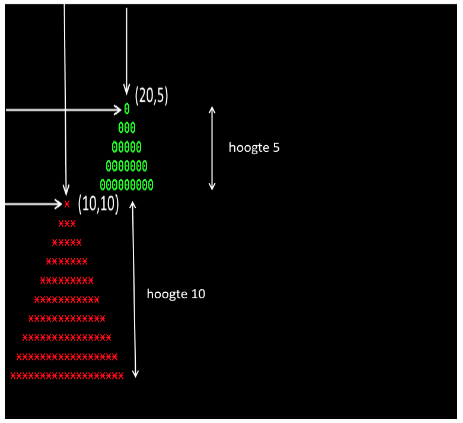

# Training - Christmas Tree Generator

Maak een methode waarmee je op een willekeurige positie op het scherm een kerstboom van een bepaalde hoogte kan maken in een bepaalde kleur. Ook moet het symbool kunnen worden meegegeven. In het screenshot hieronder hebben we de kerstbomen de volgende parameters/eigenschappen:

| Kleur | Hoogte | Left/x | Top/y | Tekensymbool |
|-------|---------|-------|--------|----------------|
| Rood | 10 | 10 | 10 | 8 |
| Groen | 5 | 20 | 5| 5 |

Gebruik een _Console_ applicatie.
Tip: gebruik **Console.ReadKey()** om te voorkomen dat het programma direct na opstarten weer afsluit.

## Stappenplan
1. Een bepaald karakter op het scherm laten afdrukken
2. Een horizontale lijn van meerdere karakters laten afdrukken
3. Een horizontale lijn van meerdere karakters laten afdrukken op willekeurige positie
4. Een horizontale lijn van meerdere karakters laten afdrukken op willekeurige positie in een bepaalde kleur
5. Een kerstboom vorm maken
6. Meerdere kerstbomen

## Uitbreidingen
- ** Vul de kerstboom met de karakters van een gegeven string, dus bijv. "abc" dan wordt de hele kerstboom gevuld met deze letters
- ** Vraag aan de gebruiker op welke positie de kerstoom moet worden geplaatst
- *** Plaats een willekeurig aantal kerstbomen met allemaal verschillende eigenschappen op een willekeurige plek, echter wel geheel binnen het venster.
- ** Versier de kerstboom met willekeurig op te hangen gekleurde kerstbomen (een letter O). De kerstballen mogen niet te dicht bij elkaar hangen, er moeten minimaal 2 vakjes tussen zitten.
- *** Maak een grafische variant in WinForms die van Windows GDI Graphics gebruik maakt.

## Bronnen
- [Color in Console App](https://www.dotnetperls.com/console-color)
- [Console.SetCursorPosition](https://docs.microsoft.com/en-us/dotnet/api/system.console.setcursorposition?view=net-5.0)
- [Console.ReadLine](https://docs.microsoft.com/en-us/dotnet/api/system.console.readline?view=net-5.0)
- 