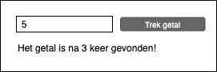

# Training - Het goede getal

Laat de gebruiker een getal invoeren. Controleer dat het getal tussen de 0 en 10 zit. Na een druk op de knop ga je willekeurige getallen trekken totdat je het getal van de gebruiker hebt. Dus stel dat het getal 6 is ingevoerd. Dan ga je een willekeurig getal trekken tussen de 0 en 10. Stel je trekt 3, dan moet je nog eens trekken. Dit herhaal je zolang je nog geen 6 hebt getrokken. Daarna laat je een melding zien dat “Het goede getal is na 3 keer gevonden!”.

