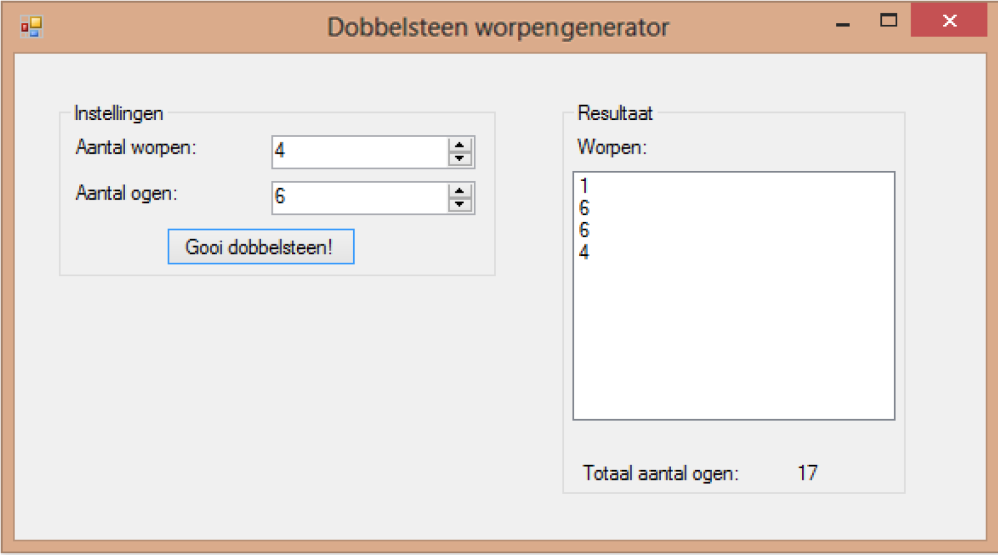

# Training - For - Worpengenerator

In veel bordspellen (of digitale varianten hiervan) worden worpen gedaan met meerdere dobbelstenen (in het bijzonder bij spellen als Yahtzee, Risk, etc.) 

Indien je geen dobbelstenen voor handen hebt of je een digitale variant van een spel aan het programmeren bent, komt een programma waarmee een x aantal dobbelstenen met y aantal ogen gegooid kan worden goed van pas.

Het programma dat je aan het eind van deze opdracht hebt gemaakt is ziet er als volgt uit:

## Deel 1
Maak een nieuw C# Windows Forms-project aan. Maak een user interface welke er als hieronder uitziet (dit is een vereenvoudigde vorm van het eindresultaat, we gaan nog even uit van dobbelstenen met 6 ogen). De kaders (Instellingen en Resultaten) zijn **GroupBox** objecten. Hiermee kun je een aantal GUI-objecten die bij elkaar horen als groepje bij elkaar zetten en later, mocht het nodig zijn, bijv. als geheel verplaatsen. Het is het handigste om de **GroupBox**\-en eerst aan te maken zodat je de andere objecten hier op kunt zetten. Het witte uitvoer vlak is een **ListBox**.
- Geef de Button, NumericUpDown, ListBox, Labels en GroupBox\-en duidelijke namen. 
- Zorg dat het aantal worpen dat gekozen mag worden minimaal 1 is en maximaal 1000. 
- Maak de EventHandler aan voor klikken op de Button “Gooi dobbelstenen!”. 
- Zorg dat als eerste de ListBox wordt leeggemaakt. Doe dit door de Items.Clear() methode aan te roepen van de ListBox. Dus: als je ListBox als naam mijnListBox heeft gaat dit zo: mijnListBox.Items.Clear() 
- In de EventHandler moet vervolgens de code komen te staan waardoor “aantal worpen” keer een willekeurig getal van 1 t/m 6 wordt toegevoegd aan de ListBox. Maak deze code.

### Tips

- Begin klein door eerst maar één worp uit te voeren en te tonen, dan kun je de code daarna gemakkelijker uitbreiden door een herhaling (for lus of while lus) toe te voegen.
- Aan een ListBox kun je een regel toevoegen door gebruik te maken van de methode Items.Add(). Dus voor de ListBox met de naam mijnListBox gaat het toevoegen van het getal tien zo: mijnListBox.Items.Add(10);
- Maak aan het begin van de EventHandler één keer een dobbelsteenobject aan en gooi hiermee “aantal worpen” keer. Dit voorkomt het telkens dezelfde hoeveelheid ogen gooien.
- Test of het programma goed werkt door veel dobbelstenen te gooien en te kijken of hierin alleen de waarden 1 t/m 6 voorkomen.

## Deel 2
Breid de user interface uit met twee **Label** objecten zoals hieronder. De ene bevat de tekst “Totaal aantal ogen:”, de andere bevat de standaard waarde “0” en zal straks het totaal aantal ogen voor de worp bevatten. Geef de **Label** objecten duidelijke namen.

Zorg dat in de EventHandler van de Button de code wordt toegevoegd waarmee het totaal aantal gegooide ogen wordt bijgehouden. Maak hiervoor gebruik van een “totaalOgen” variabele van het type int.

### Tips
- Als je een variabele binnen een for of while lus aanmaakt dan wordt deze tijdens elke herhaling aangemaakt en op het einde van de herhaling weer opgeruimd (dus voor iedere worp van iedere dobbelsteen wordt de variabele aangemaakt en weer weggegooid). Als je een variabele aanmaakt buiten, dus vlak voor een for of while lus, dan blijft deze variabele gedurende de uitvoering van de gehele for of while lus bestaan en te benaderen vanuit de for of while lus.
- Als je totaalOgen variabele na het uitvoeren van de for of while lus altijd precies de waarde heeft van de laatste worp, dan heb je heel waarschijnlijk één van de volgende fouten gemaakt:
	- Je hoogt de variabele totaalOgen niet op maar overschrijft deze met het aantal gegooide ogen.
	- Je hebt de totaalOgen variabele niet buiten de for of while lus gedeclareerd (aangemaakt), zie de tip hierboven voor wat je daaraan kunt doen.
- Test of het totaal aantal ogen juist wordt opgeteld door dit zelf na te tellen voor een aantal verschillende worpen, met telkens een andere hoeveelheid dobbelstenen.

## Deel 3
Breid de user interface uit met een Label en een NumericUpDown zoals onderstaande afbeelding. Op het Label komt de tekst “ogen op dobbelsteen”, de NumericUpDown krijgt als minimumwaarde 2 en als maximumwaarde 100. De standaardwaarde komt op 6 te staan (dit is immers de meest voorkomende hoeveelheid ogen op een dobbelsteen).

Zorg dat in plaats van een waarde van 1 t/m 6 nu een waarde van 1 t/m de waarde in de nieuwe NumericUpDown wordt gegenereerd.

## Uitbreidingen
- Niveau ** - Voeg twee extra Label objecten toe onder het totaal aantal ogen en houd hierin de "Hoogte worp tot nu toe" in bij. Doe hetzelfde voor het laagste aantal worpen tot nu toe.

## Checklist
Als je de opdracht op de juiste manier hebt uitgevoerd heb je voldaan aan onderstaande punten: 
- De NumericUpDown aantal-worpen heeft een minimumwaarde van 1 en een maximumwaarde van 1000. 
- De NumericUpDown aantal-ogen-op-dobbelsteen heeft een minimumwaarde van 2, een maximumwaarde van 100 en een standaard waarde van 6. 
- Het Label totaal-aantal-ogen staat bij het opstarten op ‘0’ 
- De gegenereerde waarden kloppen met de mogelijke waarden die je hebt opgegeven in de NumericUpDown aantal-ogen-op-dobbelsteen. De maximum- en minimumwaarde komen voor in het lijstje (als je lang genoeg dobbelstenen gooit). Test dit met een kleine hoeveelheid ogen, anders ben je lang bezig. 
- Het aantal gegenereerde waarden komt precies overeen met de waarde in de NumericUpDown aantal-worpen (je zit er bijv. niet precies eentje naast). 
- Uitbreiding: Controleer of het maximum en minimum kloppen na veel verschillende worpen. 
- Is alles in orde? Kijk dan je uitwerking na met behulp van de standaarduitwerking op de volgende pagina. Heb je alles goed? Geef dan jezelf een **schouderklopje** of vraag je favoriete klasgenoot jou er een te geven, want je hebt ‘m verdiend.
