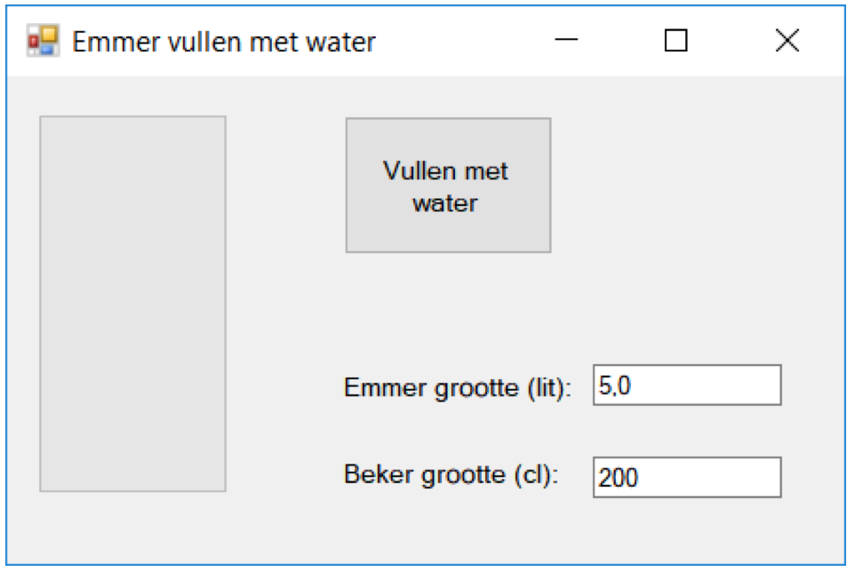

# Training - Emmer vol laten lopen

Maak gebruik van de herhalingsstructuur **while** om een emmer te vullen door herhalend een beker water erin te doen totdat ie vol is. Visualiseer de emmer met een meegeleverde custom control **VerticalProgressBar** (zie Bronnen)**.** Deze class kan je gewoon toevoegen aan je Project via RMB op je Project > Add > Existing Item of door het bestand te slepen in je project (+ moet verschijnen tijdens slepen). Als je daarna je Project Build vind je de control in je ToolBox.

De gebruiker kan instellen hoe groot de emmer (in liters) is en hoe groot de beker (in centiliter) is.



Tip: Om ervoor te zorgen dat de emmer niet meteen vol is (doordat de computer te snel de lus uitvoert) én om de UI te updaten tijdens het uitvoeren van de lus, plaats onderstaande code **in** de lus structuur:

```csharp
Thread.Sleep(100); //doe niks voor 100 ms
Application.DoEvents(); //update UI
```

Plaats nog wel even de volgende regel bovenin bij de overige using’s om de **Thread** class te kunnen gebruiken:

```csharp
using System.Threading;
```

## Bronnen
- [Vertical Progressbar](https://www.codeproject.com/Articles/8422/Vertical-ProgressBar)