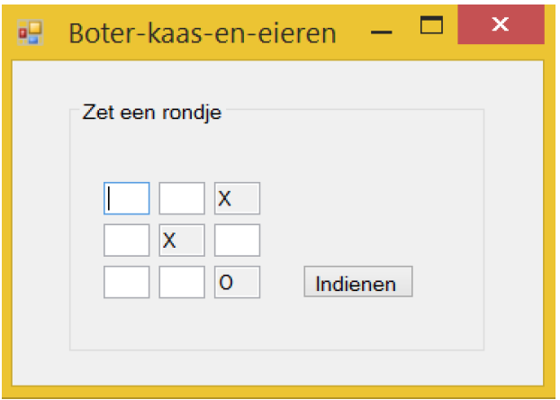

# Training - Boter, kaas en eieren tegen de computer

Bedenk eerst een algoritme (dmv Flowchart) voor boter-kaas-en-eieren. Dat algoritme kun je zo inrichten zodat iemand tegen de computer boter-kaas-en-eieren kan spelen. Denk van te voren na over hoe je dit gaat programmeren: welke variabelen heb je nodig en wanneer ga je die variabelen een waarde geven?

