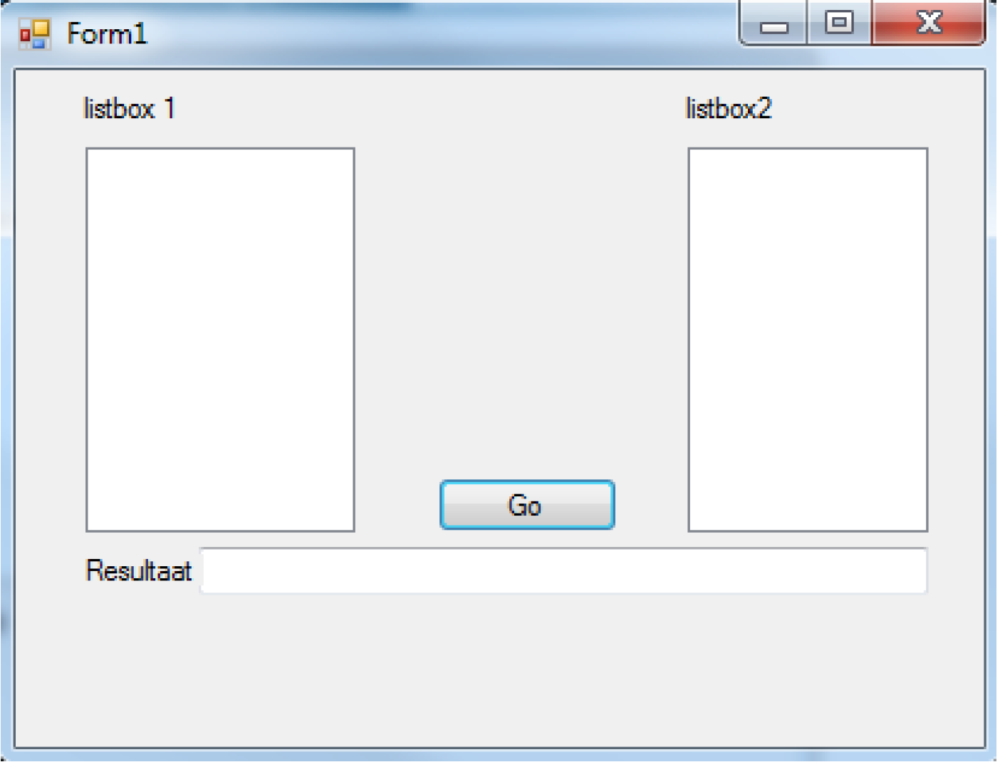

# Training - Listige listboxen

Maak een scherm met daarop **2 listboxen**, **1 knop** en **een textbox**. Het scherm ziet er dan bijvoorbeeld als volgt uit.

Vul de listboxen met 10 willekeurige getallen. Gebruik hierbij de **random generator** (dobbelsteen opdracht in week 4) en de methode **listbox.items.add**

Zorg er voor dat er na het klikken op de button een event wordt gestart die onderstaande handelingen uitvoert:
1. Ga in een **methode** met een **FOR**\-loop door de 1e listbox en tel de getallen op in een variabele. Je moet dus deze methode programmeren en die vanuit het button-click-event aanroepen. Geef de waarde van de variabele terug (return-statement in de methode). 
2. Programmeer een 2e methode (ook aanroepen vanuit de button-click) als volgt: ga in die 2e **methode** met een **WHILE**\-loop door de 2e listbox en tel de getallen op in een 2e variabele. De methode geeft de som van alle getallen van listbox2 terug. 
3. Afhankelijk van welke variabele het hoogste resultaat heeft toon je in de resultaat-textbox een tekst (‘Listbox ?? heeft de hoogste waarde namelijk: ????’). Indien listbox 1 de hoogste waarde heeft maak je die listbox **groen** en de andere **rood** en andersom. 