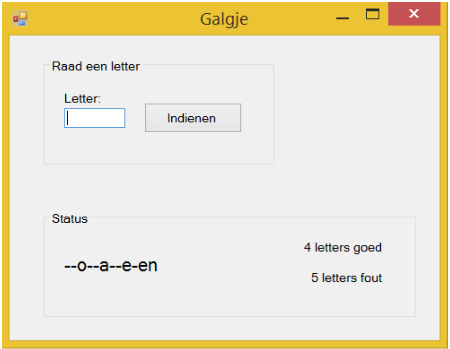

# Training - Galgje

Programmeer het spel Galgje waarbij de gebruiker een vooraf ingesteld woord moet raden. 

De gebruiker mag 10 keer een letter raden. Heeft hij daarna het woord goed dan heeft hij gewonnen, anders wint de computer. 

Ontwerpideeën: houdt in een (string-) variabele het te raden woord bij en houdt in een andere variabele bij wat de gebruiker allemaal heeft geraden.

## Uitbreidingen
1. Maak een PictureBox waarin je middels een aantal plaatjes van een galgje en poppetje het aantal fouten laat zien. Laad dynamisch elke keer het volgende plaatje in als er een fout wordt gemaakt. Kijk eens naar de methode PictureBox.Load().
2. Laat zien welke letters geweest zijn. Je kunt bijv. alle letters laten zien in een zwarte kleur. Letters die goed geraadde zijn maak je groen, letters die fout geraadde zijn maak je rood.
3. Uitbreiding op feature 2: maak de (zwarte dus niet gekozen) letters clickable. Als je er op clickt wordt dezelfde event handler als onder de knop Indienen aangeroepen.
4. Zorg dat als je een letter intypt deze automatisch wordt “ingediend”, dus dat je niet ook nog eens op de knop moet clicken. Maak tevens na het indienen van een letter de TextBox leeg en zorg dat deze altijd de focus meteen weer heeft zodat je meteen een nieuwe letter kan intypen.
5. Zorg ervoor dat je alleen letters kan intypen in de TextBox. Accepteer tevens hoofdletters. Er zijn meerdere manieren om dit op te lossen. Kijk bijv. eens naar deze StackOverflow bron waar een vergelijkbaar probleem wordt besproken of gebruik een variant op de TextBox nl. MaskedTextBox. Type je geen letter in, bijv. een cijfer, dan speelt er een errorgeluidje af.
6. Onthoud de score(s) van een bepaalde speler en schrijf deze weg naar een highscore bestand. Laat hiervoor de speler zich eerst identificeren. Maak een highscore overzicht scherm waarin alle namen met de gemiddelde aantal benodigde pogingen worden getoond.
7.  Uitbreiding op 6: Maak een login mogelijkheid waar je middels een wachtwoord jezelf moet identificeren zodat niet andere spelers met jouw highscore aan de haal gaan. Sla dit wachtwoord gehashed op in hetzelfde bestand waar ook de namen en highscores staan. Gebruik bijv. MD5 hiervoor. Elke regel in het bestand bestaat uit "<username> <md5 wachtwoord> <highscore>". 
	Omdat MD5 niet veilig is, probeer een ander hashing algoritme te vinden.