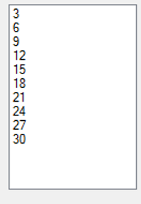

# Training method MaalDrie

Deze opdracht is ooit geschreven als een WinForm-opdracht, maar je mag ook een variatie hierop maken, zoals een Console app.

Gegeven is de volgende methode:

```cs
int MaalDrie(int input)
{
  int output = input * 3;
  return output;
}
```

+ Maak een programma met onder meer een ListBox dat bovenstaande methode aanroept met parameterwaarde 2. De returnwaarde van de methode wordt dan 6. Sla die returnwaarde op in een variabele met de naam output.
+ Voeg de waarde van de returnwaarde (6, die je in de variabele uitkomst hebt staan) toe aan de ListBox met `listBoxX.Items.Add(uitkomst);` waarbij `listBoxX` de duidelijke naam is die jij de ListBox gegeven hebt.
+ Test je programma.
+ Breid je programma uit met een lus die 10 maal doorlopen wordt. Roep in die lus de methode MaalDrie aan maar nu met parameter 1, 2, 3, 4... t/m 10. Dus de methode MaalDrie wordt 10 maal aangeroepen.


