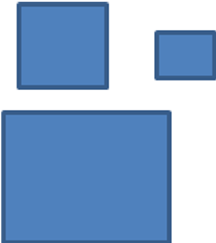

# Training De Drie Vierkanten

Schrijf een programma dat voldoet aan de volgende requirements. Het mag een Console app zijn, of een WinForm app, of misschien nog wel iets anders?

+ De gebruiker voert de lengte van een zijde van drie verschillende vierkanten in. Deze drie waarden worden in drie variabelen van het type int opgeslagen.
+ Van alle drie de vierkanten wordt de oppervlakte uitgerekend.
+ De totale oppervlakte van alle drie de vierkanten samen (dus oppervlakte1 + oppervlakte2 + oppervlakte3) wordt aan de gebruiker getoond.

+ Schrijf een `method` die de oppervlakte van een vierkant kan uitrekenen. De method heeft een parameter (die de lengte van een zijde van het vierkant voorstelt) en retourneert (`return`) de oppervlakte van het vierkant.
+ Gebruik je methode om de hierboven gemaakte code te verbeteren (methode aanroepen).
