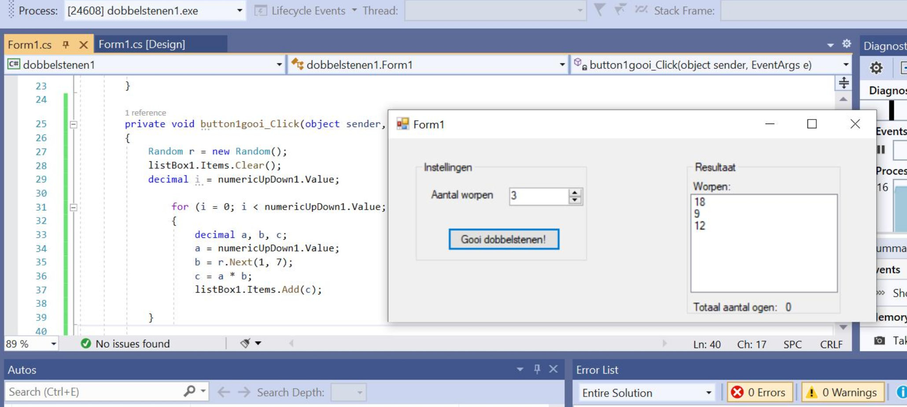

# Quiz

## Vraag: verkeerd getal

Als ik meerdere worpen doe komen er getallen boven de 6 wat eigenlijk niet moet kunnen? Waar zit de fout?:

## Vraag: Hoeveel is 8 gedeeld door 3?

Mijn programma zegt 2. Hoe kan dat? 
