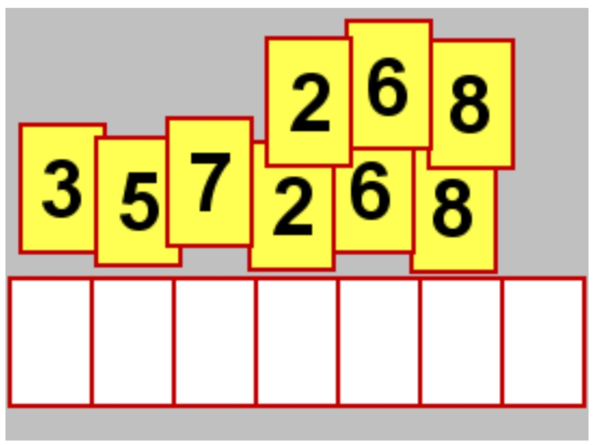

# Training Computer-rekenen

Als de computer dan toch zo'n krachtige calculator is, laten we hem dan ook als zodanig gebruiken...


## Recht-toe-recht-aan

+ 100 x 0,7 - 25 x 0,6 = ...
+ 18.0 / 5.0 = ...
+ 100 / 30 = ...

Schrijf een programma dat deze antwoorden berekent.

Als je het op een rekenmachine (bijvoorbeeld de calculator-app op je laptop) berekent: komt er dan dezelfde uitkomst uit?
Zo nee, probeer erachter te komen waarom dat zo is.

## Al wandelend...

Patrick maakt een wandeling van A naar B. De afstand is 20 km.

Hij begint in A en als hij 1/4 deel van de afstand heeft afgelegd, rust hij een poosje (rustpunt 1).
Na korte tijd hervat hij de wandeling en loopt 1/4 deel van het resterende gedeelte, Daar rust hij weer even uit (rustpunt 2).
Op dezelfde manier wandelt hij verder. Elke keer rust hij een poosje als hij weer 1/4 deel van het resterende gedeelte heeft gelopen.

De afstand van rustpunt 5 tot het eindpunt B is meter.
(Vul een geheel getal in, indien nodig afronden.)

Na rustpunt 5 maakt hij geen stops meer, omdat hij anders nooit het eindpunt zal halen."


(vraag 28aug2020, beterrekenen)

Hint:
Teken allereerst een plaatje. 
Pauzepunt 1 ligt op 3/4 van 20km van punt B.
Pauzepunt 2 ligt op 3/4 van het getal op de vorige regel...
En zo voort...


## Ik een beetje meer dan jij...

Je verdeelt een geldbedrag over vier personen (A, B, C en D). Elke persoon krijgt een ander bedrag: A krijgt 20% meer dan het gemiddelde van de vier personen. Voor de duidelijkheid: uiteindelijk krijgen de vier personen samen het hele bedrag. A krijgt daarvan een kwart + 20% van zo'n kwart. Daarna verlaat persoon A de kamer.

Er blijven drie personen over, met wie een soortgelijke verdeling plaatsvindt:
B krijgt 20% meer dan het gemiddelde van de 3 overgebleven personen en verlaat de kamer. C krijgt 20% meer dan het gemiddelde van de 2 overgebleven personen. D ontvangt de overgebleven 168 euro.

Het oorspronkelijke, te verdelen bedrag is ... euro.

Schrijf een computerprogramma dat dit getal berekent.

Hieronder een deel van de oplossing, maar probeer het eerst zelf!
(Afkomstig van beterreken.nl, 12aug2020; een som van Henk van Huffelen)

## Ik een beetje meer dan jij... aanzet tot een oplossing

Als je het in C# doet:
Maak een Console app aan en vul de Main-methode alsvolgt in:

```
static void Main(string[] args)
{
    // Ik een beetje meer dan jij...
    // ----------- een oplossing ---------------

    // Je verdeelt een geldbedrag over vier personen(A, B, C en D). Elke persoon krijgt een ander bedrag:
    // A krijgt 20 % meer dan het gemiddelde van de vier personen.
    // Voor de duidelijkheid: uiteindelijk krijgen de vier personen samen het hele bedrag.
    // A krijgt daarvan een kwart + 20 % van zo'n kwart. Daarna verlaat persoon A de kamer.

    // Er blijven drie personen over, met wie een soortgelijke verdeling plaatsvindt:
    // B krijgt 20 % meer dan het gemiddelde van de 3 overgebleven personen en verlaat de kamer. C krijgt 20 % meer dan het gemiddelde van de 2 overgebleven personen. D ontvangt de overgebleven 168 euro.

    //  Het oorspronkelijke, te verdelen bedrag is ... euro.

    // Schrijf een computerprogramma dat dit getal berekent.

    // ----------- een oplossing ---------------
    // "Achteruit terugredeneren: "
    // Het bedrag dat persoon D krijgt noemen we 'd', c is het bedrag dat persoon C, krijgt enzovoort...
    // Voor bedragen raden we het type 'decimal' aan:
    decimal d = 168;
            Console.WriteLine("d: {0}",d);

    // c kreeg 20% meer dan het gemiddelde van de laatste 2 personen: c en d.
    // Het gemiddelde van c en d is (c + d) / 2
    // c is 20% meer ofwel 1.2 * dat gemiddelde:
    // Er geldt:  c == 1.2 * ((c + d) / 2)
    // ofwel: c == 0.6 * c + 0.6 * d
    // ofwel: 0.4 * c == 0.6 * d
    // dus c = 0,6 / 0,4 * d
    decimal c = 3 / 2 * 168;
            Console.WriteLine("c: {0}", c);

    // b is 20% meer dan (b + c + d) / 3,
    // ofwel: b == 1.2 * ((b + c + d) / 3),
    // ofwel:

    maak dit programma zelf verder af!


    decimal b = 0;  // pas dit aan...
    Console.WriteLine("b: {0}", b);

    decimal a = 0;  // pas dit aan...
    Console.WriteLine("a: {0}", a);
    Console.WriteLine("Hello World!");
}
```

Maak het programma hierna af.

## Een 1-2-3-tje

In de winkel liggen 3 artikelen naast elkaar met elk een verschillende prijs in hele euro's. De prijzen zijn genoteerd zonder komma, dus bijvoorbeeld: "32 euro".

De prijs van het duurste artikel is een bedrag van 3 cijfers. Als je het eerste cijfer van dat bedrag weglaat, heb je de prijs van het tweede artikel. Laat je daarvan weer het eerste cijfer weg, dan heb je de prijs van het derde artikel.

De artikelen kosten samen 589 euro. Het middelste artikel is minder dan 30 keer zo duur als het goedkoopste artikel. Het verschil in prijs tussen het duurste en goedkoopste artikel is ... euro.

Schrijf een computerprogramma dat dit getal berekent. (of kun je het zelfs zonder computerprogramma?)

## Hoeveel palindromen kan ik maken met ...?



Een `palindroom` is een woord of getal dat achterstevoren geschreven hetzelfde is. Bijvoorbeeld het woord `LEPEL` of het getal `121`.

Je hebt de beschikking over een maal de cijfers 3, 5 en 7 en tweemaal over de cijfers 2, 6 en 8 (zie plaatje).

Hiermee kun je ... verschillende palindromen van 7 cijfers samenstellen.

(afkomstig van beterrekenen.nl, 10aug2020, een som van Henk van Huffelen).

### Bronnen

Een aantal van deze opgaven komen van
[www.beterrekenen.nl](www.beterrekenen.nl) (ook als mobile app): Elke dag een paar minuten aan uitdagingen, soms makkelijk, soms moeilijker, some recht-toe-recht-aan, soms echt nodig om een plaatje te tekenen of een laptop te hulp te roepen... hersengym dus... een aanrader!

## Spoilers...

Enkele antwoorden:
+ `Al wandelend...`: 4746 meter
