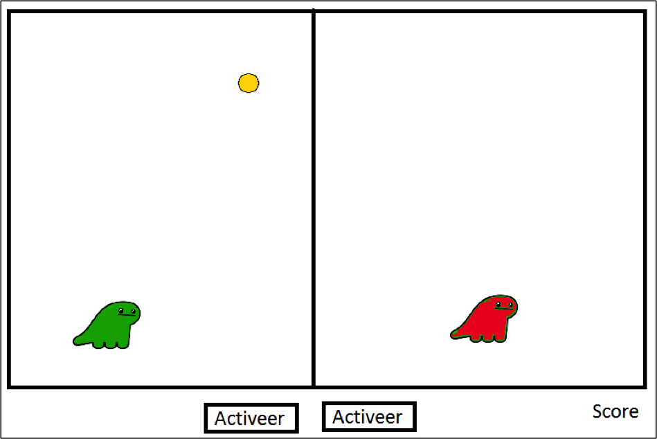

| Niveau | 3 of 5 |
| --- | --- |
| Leerdoelen | Analyse, class, enum, (pijltjes)toetsen, file read/write. |
| Vereiste voorkennis | Basiskennis over objecten. |
| Challenge Type | Realiseren. |

### De opdracht – Dino-spel
Maak een spel maken waarbij 2 dinos over het veld kunnen bewegen, één dino is groen, de ander is rood. De dino’s zitten ieder in hun eigen kooi.
 Beide dino’s hebben hun eigen knop om die dino te activeren je kan de dino dan besturen door middel van de pijltjestoetsen.
Er verschijnen muntjes op het veld, en deze moeten door één van de dino’s worden opgeraapt.  Een score wordt bijgehouden.

Eisen:
1. Analyse/vooronderzoek: start een onderzoek op met de hoofdvraag Hoe kan ik een applicatie goed besturen met de pijltjestoetsen. Maak een proof-of-concept waaruit blijkt dat dit werkt.
2. Toon ook de high score op het scherm. Sla de high score op in een tekstbestand en lees de high score weer uit bij het opstarten van het spel.

 
