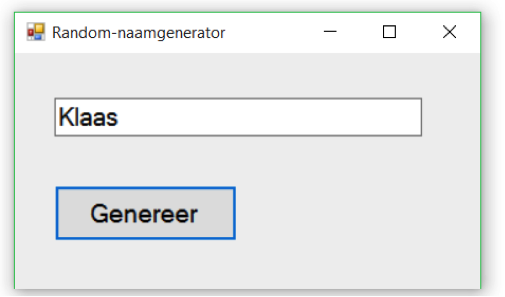

# Challenge ExceptionHandling

| Niveau | 2 of 5 |
| --- | --- |
| Leerdoelen | Exception handling. |
| Vereiste voorkennis | Basiskennis over objecten. |
| Challenge Type | Realiseren. |

---

Als startmateriaal is het programma Naamgenerator beschikbaar. Open deze solution en bekijk de code eens.
Het programma genereert een willekeurige naam uit een lijst van beschikbare namen en laat die naam op het scherm zien. De lijst van beschikbare namen staat in het bestand Namen.txt. Het programma leest dit bestand uit.

### Opdracht 1

Voeg C#-code toe die alle excepties van het programma
zoals bijvoorbeeld de IndexOutOfRangeException
en excepties die te maken hebben met bestanden/netwerk opvangen
en een duidelijke foutmelding aan de gebruiker laten zien
of (nog beter) de fout oplossen zonder dat de gebruiker het ziet.
### Opdracht 2

Breidt het programma uit zodat er naar keuze 1 of 2 namen worden geselecteerd.
De gebruiker moet van te voren kiezen of hij 2 namen of 1 naam wil zien.
Voeg user interface controls toe, en vervang bestaande controls naar keuze.
