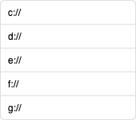

# FileHandling
	   
| Niveau | 5 of 5: integraal |
| --- | --- |
| Leerdoelen | Class, Property, Constructor, private/public, UI separation, algoritme. |
| Vereiste voorkennis | Goed om kunnen gaan met classes en objecten en GUI separation. |
| Challenge Type | Programming. |

#### Opdracht
Bestudeer de C#-klassen van het .NET-framework waar mee je kunt werken met bestanden, folders, mappen enz. C# kent allerlei methoden om tekstbestanden te lezen en te schrijven, bestanden te verplaatsen, folders aan te maken, enz.
Werk vervolgens een aantal van onderstaande casussen uit om te oefenen met file handling en vraag feedback aan je docent:

#### De Opdracht
Kies in overleg met je docent alle of enkele van de onderstaande casussen uit om te oefenen met file handling.
##### Casus 0 - Analyse
Een klasse is te zien als een structuur in C# die een aantal methoden heeft die bij elkaar horen. Schrijf een kort document waar je in beschrijft welke functionaliteiten de volgende klassen in het .NET-framework hebben. Beschrijf wat je als C#-programmeur met deze klassen kunt doen, geef een paar korte codevoorbeelden.
- File
- Directory
- DirectoryInfo
- Path

##### Casus 1 - Tekstbestandzoeker
Schrijf een Windows Forms C#-programma dat voldoet aan de volgende requirements:
1. Een user interface met minimaal 2 listboxen.
2. Na het opstarten van de app wordt in listbox1 een lijst van alle folders op de root (C:) van je harde schijf getoond.
3. Als ik op een folder (item in de listbox) klik dan verschijnt er in de andere listbox een lijst van alle bestanden met extensie .TXT.

##### Casus 1a - For-lus
Breid de applicatie van casus 1 uit met een for-lus die alle bestanden die met de letter a beginnen NIET laat zien (skipt) in de tweede listbox.

##### Casus 2 - Tekstverwerker
Maak een applicatie waarmee tekstbestanden kunnen worden bewerkt. De minimale user interface is een tekstveld, een Opslaan-knop en een Openen-knop.
1. De gebruiker kan vanuit een Windows Forms user interface op een nette manier een tekstbestand selecteren vanuit zijn computer.
2. Na een druk op de Openen-knop wordt de volledige inhoud van het bestand dat de gebruiker heeft geselecteerd getoond in een multiline tekstveld. De gebruiker kan desgewenst de tekst in het veld wijzigen.
3. Na een druk op de Opslaan-knop wordt de tekst die op dat moment in het tekstveld staat opgeslagen in het eerder geselecteerde bestand.

##### Casus 3 - Word light
1. Maak casus 1 en casus 2.
2. Maak een derde applicatie die de functionaliteit van zowel casus 1 als casus 2 bevat. Maak hierbij gebruik van een tab-control waarbij de gebruiker op de eerste tab een bestand kan uitkiezen en op de tweede tab het bestand kan bewerken.

##### Casus 4 - Fruit-generator
1. Laat de applicatie een bestand met de naam &quot;fruit.txt&quot; aanmaken.
2. Laat de applicatie op 5 regels de teksten &quot;banaan&quot;, &quot;sinaasappel&quot;, &quot;kiwi&quot;, &quot;mandarijn&quot; en &quot;aardbei&quot; wegschrijven. Open het bestand in Windows Kladblok om te kijken of je applicatie goed werkt.
3. Breidt de applicatie uit zodanig dat ze een melding geeft als het bestand &quot;fruit.txt&quot; al bestaat.

##### Casus 5 - Mijn computer
Maak een applicatie die alle schijven van je computer laat zien (zoals Windows Verkenner dat kan) in een eenvoudige listbox. Zie

##### Casus 5a
Voeg aan de Mijn Computer-applicatie de volgende functionaliteiten toe:
- Mogelijkheid om een bestand te kopiëren naar een andere locatie
- Mogelijkheid om een bestand te hernoemen

##### Casus 5b (verdieping)
Toon tijdens het kopiëren van een bestand (zie Casus 5a) een progress bar die aangeeft hoe lang de kopieeractie nog duurt.

##### Casus 6 - Zoek in bestand
Maak een applicatie die een willekeurig door de gebruiker ingevuld woord kan opzoeken in een bestand. Toon het regelnummer in het bestand waar het woord voorkomt op het scherm.

