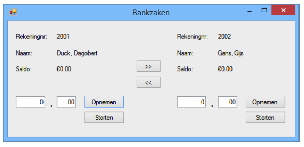

# Training Bankrekening

| | |
|---|---|
| Leerdoelen | constructor, this, static | 
| Vereiste voorkennis | Basisbegrip class, object | 
| Challenge Type | Realiseren | 


In deze opdracht maak je een toepassing die een (sterk vereenvoudigde) bank  voorstelt met maar enkele bankrekeningen. 

Met deze toepassing kan de gebruiker:
- Geld storten op een bankrekening. Alleen een positief bedrag kan gestort worden. Bij een poging iets anders te storten dan positieve getallen wordt de transactie niet uitgevoerd en wordt een foutmelding gegeven. 
- Geld opnemen van een rekening. In de TextBoxes vul je het bedrag in, vervolgens klik je op de Button “Opnemen”. Indien er een negatief saldo zou ontstaan, of als er iets anders ingevuld is dan positieve getallen wordt de transactie niet uitgevoerd en wordt een melding gegeven aan de gebruiker.
- Geld overboeken van links naar rechts (of van rechts naar links). De gebruiker vult het over te maken bedrag in en kiest de functie 'overmaken'.  Indien er een negatief saldo zou ontstaan bij de betalende partij, of als er iets anders ingevuld is dan positieve getallen wordt de transactie niet uitgevoerd en wordt een duidelijke melding gegeven. 
- Het weergegeven saldo wordt na iedere transactie netjes aangepast.


## Opdracht

Let op: om aan te tonen dat je met Objecten kunt programmeren is het belangrijk dat je niet alleen een opdracht als deze 'braaf uitvoert', maar dat je ook zelf verzint hoe je uitbreidingen op je programma kunt maken. Aan het einde van dit document begint de challenge dus pas echt!  

Stel je voert deze opdracht uit in C#. Het kan dan als Console, als WinForms, als WPF, als UWP doen, of helemaal zonder UI (user interface) en dan unit tests gebruiken om aan te tonen dat ie werkt. 

## Stap 1:  De (Grafische) User Interface

Ga er vanuit dat de gebruiker van je app een bankmedewerker is, die verzoeken van klanten uitvoert. 

Een goed begin is in dit geval om te schetsen hoe de app er uit komt te zien. Daarna wordt gekeken welke `classes` er nodig zijn en bijvoorbeeld welke `methodes` en `properties` er zijn. Hieronder een voorbeeld van een (te) simpele GUI. 



Waarom is deze te simpel? Nou, het is net genoeg om een beetje te kunnen testen of de functionaliteit werkt, maar erg realistisch is het natuurlijk niet: een Bank met maar 2 Bankrekeningen. Daar moet dus nog wel verder over worden nagedacht. (voor de kale trainings-opdracht is het goed genoeg, maar als je een docent wilt overtuigen dat je weet hoe je software moet ontwikkelen... ). 

Als je tevreden bent over het grafische GUI design is het tijd om  het te gaan maken in de IDE en het UI-framework van je keuze. Geef de GUI-componenten een betekenisvolle naam: We zijn tenslotte geen hobbyisten, we zijn software engineers in wording.  


## Stap 2: De class Bankrekening
Maak een nieuwe `class` Bankrekening aan in een nieuwe `file` (in de meeste programmeertalen staat elke `class` in een eigen file). Elke bankrekening heeft een *rekeningnummer*, staat op *naam van een persoon* en heeft een *saldo*. Zorg er voor dat de class Bankrekening Fields heeft om de benodigde gegevens op te slaan: 

```cs
// Fields
private int rekeningnummer;
private string naam;
private int saldo; // het saldo in hele centen
private static int volgendeVrijeRekeningnummer = 2001;
```

Je zou in plaats van deze Fields ook Properties kunnen gebruiken. Heb je een voorkeur? 

De persoon van wie de bankrekening is slaan we op in `naam`: we laten in het midden of dit een voornaam is of voor- en achternaam. 

Hier wordt het saldo in ***centen*** bijgehouden in een `int`: je mag hier een ander type voor gebruiken als je een beter idee hebt. 


Maak de implementatie van de methodes waarbij “vul zelf in” staat, zelf af. 

```cs
// Methods
public void NeemOp(int bedrag)
{
    // bedrag in hele centen, negatieve bedragen worden genegeerd.
    // vul zelf in
}

public void Stort(int bedrag)
{
    // bedrag in hele centen, negatieve bedragen worden genegeerd.
    // vul zelf in
}

public void MaakOver(Bankrekening andereRekening, int bedrag)
{
    // bedrag in hele centen, negatieve bedragen worden genegeerd.
    // vul zelf in
}
```


### Static variabele

Merk op dat er `static` staat voor de variabele volgendeVrijeRekeningNummer en dat deze variabele op 2001 wordt geïnitialiseerd. Dat er `static` staat betekent dat dit een zogenaamde `class variabele` is. Een `class variabele` bestaat al voordat er een `instantie` (ofwel `object`) gemaakt is van die `class` en wordt bij het opstarten van de applicatie geïnitialiseerd en dus niet pas bij het instantiëren (aanmaken) van het object van die classe, zoals `instance variabelen` (ofwel `Fields`). Het voordeel van een class variabele is dat deze voor alle instanties van deze classe dezelfde waarde heeft. 

Elke nieuwe bankrekening moet natuurlijk een uniek rekeningnummer hebben. Bij deze bank zijn dat de nummers vanaf 2001. De eerste bankrekening, die gecreëerd wordt, krijgt rekeningnummer 2001, de volgende rekeningnummer 2002, etc. Het bepalen van het volgende vrije rekeningnummer gebeurt in de Constructor.

### Constructors

Een Constructor is een `soort-van-method` met dezelfde naam als de klasse die wordt uitgevoerd als een object van die aangemaakt wordt en dient om de Fields of Properties van de klasse te initialiseren. 

Een class kan meerdere `Constructors` hebben: Een om bijvoorbeeld een Bankrekening aan te maken als de naam van de rekeninghouder bekend is en het beginsaldo 0 en een voor het geval dat er wel sprake is van een beginsaldo, bijvoorbeeld als onderdeel van een wervingsactie van de bank.


```cs
// Constructors
public Bankrekening(string naam)
{
    this.naam = naam;
    saldo = 0;
    rekeningnummer = volgendeVrijeRekeningnummer;

    // we hogen het volgende vrije rekeningnummer met 1 op zodat de
    // volgende bankrekening een nummer krijgt dat 1 hoger is dan
    // deze bankrekening.
    ++volgendeVrijeRekeningnummer;
}

public Bankrekening(string naam, int saldo)
{
    // vul zelf in
}
```


Het is in veel C#-teams gebruikelijk om de Contructors na de Properties en voor de Methoden te zetten.

## Stap 3: De BankrekeningForm-class

Maak in het BankrekeningForm een Field van type 

```cs
List<Bankrekening>
```

voor het opslaan van bankrekeningen. Initialiseer dit in de Constructor van het formulier.

```cs
public partial class BankrekeningForm : Form
{
    // Fields
    private List<Bankrekening> bankrekeningen;

    // Constructor
    public BankrekeningForm()
    {
        InitializeComponent();
        bankrekeningen = new List<Bankrekening>();
		Bankrekening bankrekeningDD = new Bankrekening("Dagobert Duck", 999999);
		bankrekeningen.Add(bankrekeningDD);
		Bankrekening bankrekeningGG = new Bankrekening("Gijs Gans", 5);
		bankrekeningen.Add(bankrekeningGG);		
    }
```


Maak het nu zo dat je GUI de methods van de bankrekening aanroept. Maak de gevraagde functionaliteit en realiseer de foutafhandeling. Controleer op geldige invoer en update de info op het scherm. Je kunt hiervoor de methode ToString gebruiken, waarbij je opgeeft dat je het saldo als valuta wilt. Als je namelijk wilt dat een numerieke waarde als valuta weergeven wordt dan kun je daarvoor de methode `ToString` gebruiken. Je geeft dan als `parameter` een hoofdletter 'C' mee om aan te duiden dat het currency (valuta) is: 

```cs
double saldo = 120.55;
lblSaldo.Text = saldo.ToString(“C”);
```

Test als je klaar bent of alle functies en de foutafhandeling goed werken. Gebruik hiervoor de lijst van gewenste functionaliteit aan het begin van dit document. 


### TryParse

Als je wilt controleren of een ingetypte tekst een geheel getal is, kun je gebruik maken van onderstaande methode.

```cs
bool int.TryParse(string text, out int result);
```

Zoals je ziet is bij de declaratie van de tweede parameter `out` vermeld. Dit betekent dat deze methode de waarde van result mag aanpassen. Bij het aanroepen van de methode moet ook `out` vermeld worden. De waarde van de parameter result kan na het aanroepen van TryParse veranderd zijn. Als true wordt teruggegeven, bevat tekst een heel getal en heeft result de waarde. Zo niet, dan is er iets anders ingegeven dan een geheel getal en bevat result geen geldige waarde. Let op: een negatief geheel getal is ook een geheel getal.

```cs
if (int.TryParse(txtEuroLinks.Text, out getal))
{
    // de invoer in txtEuroLinks is een geheel getal en
    // de waarde zit nu in de variabele ‘getal’.
}
```

Zie MSDN voor meer informatie.

## Stap 4: Und jetzt gehts los! 

Vrij vertaald: Vanaf hier mag jij helemaal los gaan! Tot zover was het een trainingsopdracht, waarmee je de basiskennis en dito vaardigheden op kon doen. Vanaf hier komt de mogelijkheid om te laten zien dat je OOP beheerst. 

Hier volgen een aantal voorbeelden van extra fuctionaliteiten waarmee je je bank kunt uitbreiden. 

### Meer dan 2 rekeningen 
Hopelijk heb je hier al over nagedacht, maar een bank met maar 2 rekeningen zal weinig winst maken. Zorg dat het aantal rekeningen groter dan 2 kan zijn, en dat een gebruiker een nieuwe rekening kan aanmaken. De gebruiker van je app is een bankmedewerker. 

### Transactieoverzicht 
Toon een lijst van `transacties` op het scherm waarin de transacties worden weergegeven onder vermelding van datum, tijd, betrokken rekeningnummer(s) en bedrag. Naar keuze geef je alleen geslaagde of zowel geslaagde als niet geslaagde transacties weer. In het laatste geval wordt er tevens vermeld of de transactie geslaagd is of niet. 

### Bedragen
Bij een beetje bank kan ik natuurlijk bedragen overmaken in centen. Als Nederlander ben ik gewend dat ik een komma kan gebruiken in bedragen, maar wat als het een internationale bank is? Wat als ik een punt gebruik? Kan het gebeuren dat ik 1 euro wil overmaken en dat het door een misverstand (omdat ik 1.000 type?) 1000 euro wordt? Of andersom. Niet wat je wilt! 


