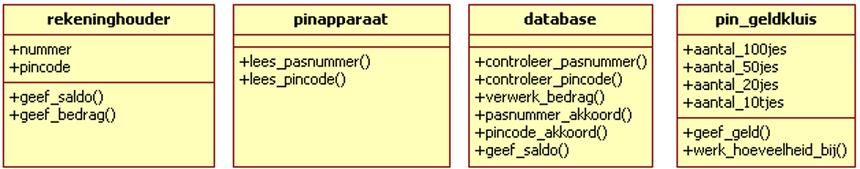

# Voorbeeld OOP: pinautomaat

Als voorbeeld van Object Oriented Programming wordt hier het automatiseren van een PIN-automaat besproken.

## Objecten
Bij de pinautomaat heb je te maken met een aantal objecten, dat zijn de zaken die bepaalde handelingen verrichten.
Je hebt bijvoorbeeld de pin-klant. Die zal een rekening hebben bij een bepaalde bank, en een pinpas, anders kan hij of zij niet pinnen. Daarom noemen we de pinklant vanaf nu een rekeninghouder. Dat is het eerste object.
Dan hebben we de pinautomaat zelf, dat is ook een object.
Verder is er een object, waarin het geld zit dat gepind kan worden. Dat noemen we de pin-geldkluis. Dat object zal vast heel dicht in de buurt van de pinautomaat zitten, maar we nemen toch maar aan dat het een apart object is.
En natuurlijk zal bij het pinnen de database van de bank geraadpleegd moeten worden, dat kun je ook een object noemen.

## Klassen en instanties
Er zijn natuurlijk een heleboel rekeninghouders. De verzamelnaam voor al die rekeninghouders is een klasse.
En als je een bepaalde rekeninghouder hebt, bijvoorbeeld de heer R.J. van der Beek, dan is dat een object. Het wordt ook wel een instantie van de klasse rekeninghouder genoemd.
De verzamelnaam voor alle pin-geldkluisen is de klasse pin-geldkluis.
Als je de pin-geldkluis van de pinautomaat van de Frieslandbank in Buitenpost als voorbeeld neemt, dan is dat een object. En het wordt ook wel een instantie van de klasse pin-geldkluis genoemd.
De termen instantie en object worden door elkaar gebruikt.

## Attributen
In die pin-geldkluis van de pinautomaat van de Frieslandbank in Buitenpost zit een bepaalde hoeveelheid bankbiljetten. Er zitten misschien wel 200 biljetten van 100 euro in, en misschien ook wel 200 biljetten van 50 euro, en een aantal biljetten van 20 euro en een aantal biljetten van 10 euro. Die aantallen noem je de attributen van de klasse pin-geldkluis. En de pin-geldkluis bevat vast ook wel een chip met geheugenplaatsen, waarin die aantallen worden vastgelegd.

## Operaties
Die aantallen veranderen natuurlijk voortdurend, en in de geheugenplaatsen moeten die veranderingen ook worden bijgehouden.
Als er 200 euro is gepind (4 keer 50 euro) dan moet het aantal 50jes met 4 worden verminderd. Het programma-onderdeel dat daarvoor zorgt noem je een operatie of methode. Dus een klasse bevat ook een aantal operaties.
Je hebt een operatie die we maar "WerkHoeveelheidBij". En die 200 euro moet dan in de la van de pinautomaat worden gelegd, de operatie die daarvoor zorgt noemen we "GeefGeld".
Je ziet vaak dat operaties werkwoorden zijn en attributen zijn vaak zelfstandige naamwoorden (klassen zijn ook zelfstandige naamwoorden).
De term operatie komt uit de UML. Een operatie in UML wordt in C# een methode genoemd.

In UML worden klassen door rechthoeken voorgesteld, met bovenin een vak waarin de naam van de klasse.
De attributen en operaties  van de klasse worden weergegeven in twee andere vakken binnen de rechthoek, de attributen in het middelste vak en de operaties in het onderste vak.

Als je een diagram maakt met daarin alle klassen, dan noem je dat het klassendiagram. Van het pinproject zie je het het klassendiagram hieronder. Daarin zie je dat er ook klassen bestaan die geen attributen hebben.

## Object Oriented
In UML worden de dingen, die er gebeuren, meestal omschreven als het versturen van boodschappen door objecten, en het uitvoeren van operaties (of methoden) door de objecten.
Als de rekeninghouder R.J. vd Beek zijn pinpas in het pinapparaat plaatst, dan wordt die gebeurtenis in UML omschreven als: het object R.J. vd Beek stuurt de volgende boodschap naar het pinapparaat: controleer mijn pinpas.

Het pinapparaat voert vervolgens de operatie "LeesPasnummer" uit.
Daarna stuurt het pinapparaat een seintje naar de erop aangesloten computer om in de database het pasnummer te controleren.
Die gebeurtenis wordt in UML omschreven als: het object pinapparaat stuurt de volgende boodschap naar het object computer: controleer het pasnummer.
En zo gaat dat verder.

De basisidee van object-georiënteerd modelleren is dat de wereld bestaat uit objecten die met elkaar communiceren door elkaar boodschappen te sturen. Of in andere woorden: uit objecten die methoden van elkaar aanroepen.
