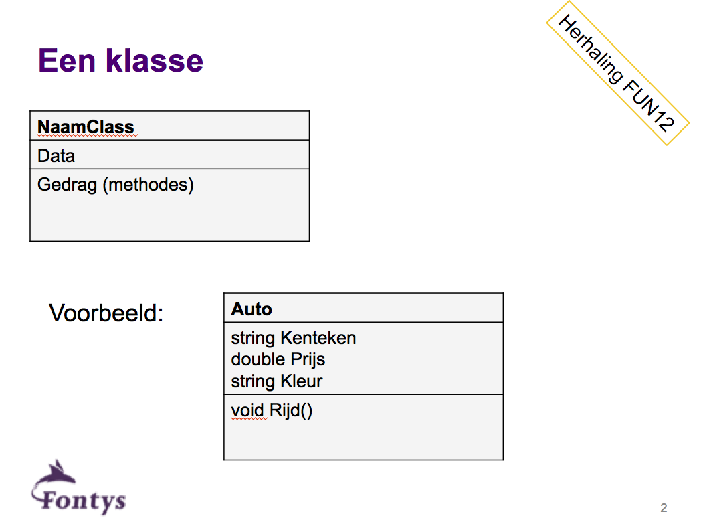

# Constructor

Wat gebeurt er dan precies onder water als je een object aanmaakt met new?

Het statement `new Clown()` is bedoeld om van de class `Clown` een nieuw object aan te maken. Het statement roept de zogenaamde `constructor` aan. Een constructor lijkt op een `method`,  maar is geen gewone method.  

Hoe herken je een constructor in C#-code:
+ Constructor heeft altijd exact dezelfde naam als de class.
+ Constructor heeft nooit een return-type  en ook geen void ervoor.




## Een voorbeeld

Zie figuur
[](#fig:clown).


```cs
public class Clown
{
   // velden  
   public string Name;
   public int Height;

   // methoden 
   public void TalkAboutYourself()  
   { 
      MessageBox.Show("My name is " + this.Name
                  + "and I’m " + Height + " inches tall.");
   }

   // mogelijk nog meer code...
}
```


Dan is mogelijk:

```cs
Clown oneClown = new Clown();   
oneClown.Name = "Boffo";
oneClown.Height = 14;
oneClown.TalkAboutYourself();

Clown anotherClown = new Clown(); //aanmaken object anotherClownㄢotherClown.Name = "Biff";
anotherClown.Height = oneClown.Height + 2;
anotherClown.TalkAboutYourself();
```


```cs
public class Guy
{
   //velden
   private string name;
   private int cash;

   //constructoren
   public Guy(string nm, int c)
   {
      name = nm;
      cash = c;
   }

   public Guy(string nm)
   {
      name = nm;
      cash = 33;
   }

}
```

Een class kan meerdere constructors hebben.

```cs
Guy someGuy;
Guy anotherGuy;
someGuy = new Guy("Joe",20);
anotherGuy = new Guy("Jack");
```


Let op: code hoort thuis in classes, niet in forms!


## Relevante trainingen
Invaders en Galgje.

## Wat is constructor overloading?

*Constructor overloading* betekent dat binnen een class meerdere  constructors bestaan. 


