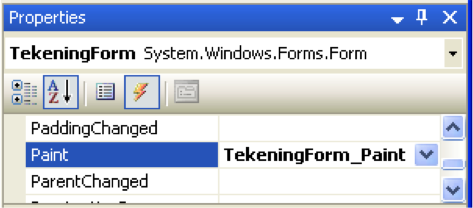
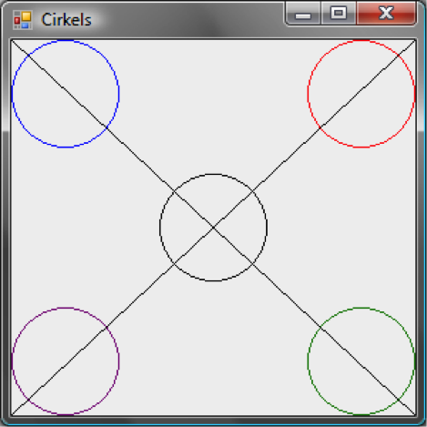

### Graphics tutorial: Inleiding

In deze opdracht gaan we kennismaken met het zelf tekenen van figuren.
#### Het Graphics object
Elk `object` van het type *Form*, *Button*, *Panel*, *PictureBox*, etc.
(ook wel *control* object genoemd) heeft een bijbehorend *Graphics* object.
Dit Graphics object maakt het mogelijk om op de achtergrond van de control te tekenen.
Het Graphics object van een control kun je opvragen met de `method` *CreateGraphics()*:

```cs
Graphics graphics = CreateGraphics();
```

Na het opvragen van het Graphics object kun je deze gebruiken om te tekenen.
De regel

```cs
graphics.DrawLine(Pens.Blue, 10, 10, 20, 10);
```

tekent een lijn met een blauwe pen van punt (10,10) naar punt (20,10)
In de volgende opdracht gaan we er stap voor stap mee oefenen.


### Opdracht
#### Stap 1: Mijn eerste tekening
We gaan in deze eerste opdracht een programma maken dat een aantal figuren
op een `Form` tekent wanneer er op een knop gedrukt wordt.
Doe:
Maak een nieuw project in Visual Studio en noem dit project ‘MijnEersteTekening’.
Hernoem de ‘Form1’ klasse naar ‘TekeningForm’. Zet een knop onderaan het Form,
noem deze knop ‘drawButton’ en zet er een label met de tekst ‘Draw’ op.
Laat het programma de volgende code uitvoeren als er op de knop gedrukt wordt (lees de uitleg in het commentaar):

```cs
	// Vraag het Graphics object op, dat bij dit form hoort.
	// Met dit graphics object kunnen we op het form tekenen.
	Graphics graphics = CreateGraphics();
	// Na het opvragen van het Graphics object kunnen we gaan tekenen.

	int breedte = 100;
	int hoogte = 50;

	// Teken een rechthoek op coordinaat (10, 10)
	// en een gevulde rechthoek op coordinaat (10, 70).
	graphics.DrawRectangle(Pens.Black, 10, 10, breedte, hoogte);
	graphics.FillRectangle(Brushes.Blue, 10, 70, breedte, hoogte);
```

Je hebt nu je eerste programma gemaakt dat zelf tekent.
Andere methoden van het *Graphics* object:

- `DrawLine(...)`
- `DrawBezier(...)`
- `DrawEllipse(...)`
- `DrawPolygon(...)`
- `DrawRectangle(...)`


Doe:
Voer het programma uit en kijk of het doet wat je verwacht!
Alles lijkt goed te gaan, maar... Wat gebeurt er als je na het zien van de tekening:
- het form minimaliseert en weer maximaliseert?
- het form van grootte verandert door de hoek rechtsonder te verslepen (eerst heel klein en dan groter maken).
- een window van een andere applicatie over de tekening sleept.

Zoals je zult merken wordt door bovenstaande acties de tekening deels of geheel gewist. Dit is meestal niet de bedoeling. Eens getekend, altijd getekend zou je verwachten.
Om de afbeelding te herstellen kun je natuurlijk opnieuw op de draw knop klikken. Deze zal de tekening opnieuw tekenen (probeer!). Maar… is dit niet een beetje omslachtig?
Lees verder om te ontdekken hoe dit beter kan.

#### Stap 2: Tekenen met het Paint event

In de vorige opgave hebben we gezien dat de tekening beschadigd raakt bij bepaalde acties en dat we de tekening kunnen herstellen door hem opnieuw te tekenen.
De vraag die overblijft is: wanneer moeten we de tekening opnieuw tekenen (lees: herstellen)?
Hiervoor gebruiken we het *Paint* `event` van het `form`.
Ieder `form` bevat een *Paint* `event`,
dat automatisch afgevuurd wordt als het form (en de tekening er op) beschadigd raakt.
Door aan  het *Paint* `event` een `event-handler` te hangen kunnen we de tekening herstellen.
Help! Event en event-handler?! Wat was dat ook alweer?
Denk even aan de deurbel. Iemand drukt op de bel, en de bel gaat rinkelen (`event`).
Jij hoort de bel rinkelen (`event-handler`) en gaat de deur openen (invulling `event-handler`).
In deze opgave gaan we het programma van Stap 1 opnieuw maken,
maar deze keer gaan we het Paint event gebruiken om te tekenen.
Doe:
Maak een nieuw project in *Visual studio* en noem dit project *TekenenMetHetPaintEvent*.
Hernoem de *Form1* `class` naar *TekeningForm*.
Zet een knop onderaan het Form, noem deze knop *drawButton* en zet er het `label` *Draw* op.
Maak vervolgens een `event-handler` aan voor het *Paint* `event` van het *TekeningForm*.



Dit kun je doen door in het `properties` venster van het *TekeningForm*
te dubbelklikken op het *Paint* `event`.
Let op dat het bliksempje ingedrukt is, zodat je de events ziet (figuur
[](#fig:EventHandler)
).
 
Visual Studio voegt nu de volgende code toe aan het TekeningForm. Dit is de event-handler voor het Paint event.

```cs
private void TekeningForm_Paint(object sender, PaintEventArgs e)
{

}
```

Komt dit je bekend voor? Juist, het `event mechanisme` is niet nieuw voor je.
Je hebt al events gebruikt bij het koppelen van acties aan het indrukken van een knop.
Verder met tekenen. Zet de code voor het tekenen (zie Stap 1) in de `event-handler` van het *Paint* `event`.
Je krijgt dan

```cs
private void TekeningForm_Paint(object sender, PaintEventArgs e)
{
    // Vraag het Graphics object op, dat bij dit form hoort.
    // Met dit graphics object kunnen we op het form tekenen.
    Graphics graphics = CreateGraphics();

    // Na het opvragen van het Graphics object kunnen we
    // gaan tekenen.
    int breedte = 100;
    int hoogte = 50;

    // Teken een rechthoek op coordinaat (10, 10)
    // en een gevulde rechthoek op coordinaat (10, 70).
    graphics.DrawRectangle(Pens.Black, 10, 10, breedte, hoogte);
    graphics.FillRectangle(Brushes.Blue, 10, 70, breedte, hoogte);
}
```

Doe:
Voer het programma uit en kijk of het doet wat je verwacht!
Blijft de tekening nu wel staan als je de form minimaliseert en maximaliseert of wanneer je de grootte veranderd?
Wat het programma in ieder geval NIET doet, is zich gedragen als het programma uit Stap 1;
je tekening wordt direct na het starten op je scherm gezet en de ‘Draw’ knop heeft geen enkele functie.
Dit gaan we anders doen, want het programma moet werken als in opgave 1 gevraagd wordt.
Maar voordat we daar aan beginnen, eerst nog iets belangrijks...

#### Stap 3: Gebruik maken van het juiste Graphics object in de Paint event-handler

Doen we dat dan nog niet? Het programma uit opdracht 2 tekent toch netjes?
Ja, maar een werkend programma is niet altijd een goed programma. Wat is er aan de hand?
Kijk in de code van Stap 2. In de code van de *Paint* `event-handler` staat.

```cs
	Graphics graphics = CreateGraphics();
```

Hier staat dus: Vraag het Graphics object op dat bij het TekeningForm hoort. Dit lijkt te kloppen want die willen we opnieuw tekenen.
Het opvragen van het Graphics object kan echter op een betere manier.
De *Paint* `event-handler` krijgt namelijk informatie mee over het object dat het Paint event afgevuurd heeft en dat dus opnieuw getekend moet worden. Deze informatie zit in de parameter van het type PaintEventArgs en bevat o.a. het Graphics object dat nodig is om te tekenen. Deze kun je opvragen met:

```cs
	Graphics graphics = e.Graphics;
```

Je krijgt dan

```cs
private void TekeningForm_Paint(object sender, PaintEventArgs e)
{
    // Vraag het Graphics object op van de control, die dit Paint
    // event heeft verzonden. Met het graphics object kunnen we
    // tekenen op dit control.
    // Definitie 'control': Een control is een User Interface object.
    // Voorbeelden van controls: TextBox, PictureBox, Button, Label,
    //                           Form, Panel, etc
    Graphics graphics = e.Graphics;
    // Na het opvragen van het Graphics object kunnen we
    //gaan tekenen.
    int breedte = 100;
    int hoogte = 50;
    // Teken een rechthoek op coordinaat (10, 10)
    // en een gevulde rechthoek op coordinaat (10, 70).
    graphics.DrawRectangle(Pens.Black, 10, 10, breedte, hoogte);
    graphics.FillRectangle(Brushes.Blue, 10, 70, breedte, hoogte);
}
```

Doe:
Vervang de Paint event-handler uit je programma van opdracht 2 door de bovenstaande en probeer je programma uit.
*Problemen met het programma?*
We hebben nu een programma dat op de goede manier tekent. Maar het programma werkt nog niet als het programma uit Stap 1: de ‘Draw’ knop heeft nog geen functie. Dat gaan we aanpakken in de volgende opdracht.
#### Stap 4: De ‘Draw ’knop gebruiken om te tekenen
We gaan bij deze stap verder bouwen aan de code die gegeven is in ‘voorbeeldcodeTekenenMetHetPaintEvent’.
We gaan code toevoegen die ervoor zorgt dat er pas getekend wordt nadat er op de ‘Draw’ knop gedrukt is.
Doe:
Maak een kopie van de map ‘voorbeeldcodeTekenenMetHetPaintEvent’. Met deze kopie ga je verder werken. Open de gekopieerde solution.
In Stap 2 is gebleken dat we alleen mogen tekenen in de `event-handler` van het *Paint* `event`.
Tekenen in de `event-handler` van de ‘Draw’ knop is ‘verboden’.
Hoe kunnen we er nu toch voor zorgen dat er pas na het drukken op de *Draw* knop getekend wordt en niet direct na de start van het programma?
*Een eerste plan:*
We introduceren een nieuw bool dataveld *laatTekeningZien* in onze *TekeningForm* class.
Dit nieuwe `dataveld` gaat bijhouden of er getekend mag worden.
Initieel mag er niet getekend worden, dus de initiële waarde van *laatTekeningZien* moet *false* zijn.
In de *Paint* `event-handler` gaan we de conditie van *laatTekeningZien* gebruiken voor
het wel/niet tekenen van de figuren. Het drukken op de *Draw* knop moet ervoor zorgen dat
*laatTekeningZien* *true* wordt en er dus getekend mag worden.
Als we dit plan uitvoeren krijgen we de volgende code in de klasse TekeningForm:

```cs
  private bool laatTekeningZien; // laat tekening alleen zien als true.

  public TekeningForm() {
    InitializeComponent();     // Zorgen voor de juiste initialisatie:
    laatTekeningZien = false;  // Initieel geen tekening op het Form.
  }

  private void TekeningForm_Paint(object sender, PaintEventArgs e) {
    if (laatTekeningZien) {
      Graphics graphics = e.Graphics;
      int breedte = 100;
      int hoogte = 50;
      graphics.DrawRectangle(Pens.Black, 10, 10, breedte, hoogte);
      graphics.FillRectangle(Brushes.Blue, 10, 70, breedte, hoogte);
    }
  }

  private void drawButton_Click(object sender, EventArgs e) {
    laatTekeningZien = true;   // Ervoor zorgen dat er getekend kan worden.
  }
```


Doe:
Zorg ervoor dat het programma in je gekopieerde project werkt als de bovenstaande code.
Wat verwacht je dat het programma doet? Voer het programma uit en kijk of je verwachtingen kloppen.
Wat gebeurt er als je de form minimaliseert en maximaliseert na het drukken op de *Draw* knop?
Wat denk je dat hier aan de hand is?
Het programma lijkt nu compleet. Toch gaat er nog iets mis waardoor er niet direct getekend wordt na het drukken op de *Draw* knop. Na het minimaliseren en maximaliseren van de form is de tekening er ineens wel. Rara hoe kan dat?
Verklaring: Het minimaliseren en maximaliseren van het TekeningForm veroorzaakt
automatisch een *Paint* `event`. Door het *Paint* `event` wordt de
*TekeningForm_Paint* `event-handler` aangeroepen en die gaat tekenen
(we hebben immers zelf *TekeningForm_Paint* aan het *Paint* `event` verbonden, zie Stap 2).
Als we dus willen tekenen na het drukken op de *Draw* knop moeten we niet alleen *laatTekeningZien* op *true* zetten.
We moeten er ook voor zorgen dat er een *Paint* `event` afgevuurd wordt. Hoe doen we dit?
Je kunt een *Paint* `event` forceren door de `methode` *Refresh()* aan te roepen.
Laten we het dit eens toepassen in de *Click* `event-handler` van de *Draw* knop:

```cs
private void drawButton_Click(object sender, EventArgs e) {
    laatTekeningZien = true; // Ervoor zorgen dat er getekend kan
                             // worden.
    // Het aanroepen van Refresh() zorgt ervoor ervoor dat het Form
    // als 'beschadigd' wordt gemarkeerd. Hierdoor wordt zijn paint
    // event automagisch afgevuurd.
    // Gebruik van de Refresh() methode forceert dus het opnieuw
    // tekenen van het form dmv het Paint event.
    Refresh();
}
```

Doe:
Probeer bovenstaande code in je programma uit. Je hebt nu een werkend programma.

 
Napraten:
Slimmeriken hebben misschien het volgende geprobeerd:

```cs
// VOORBEELD VAN HOE HET NIET(!) MOET...
private void drawButton_Click(object sender, EventArgs e) {
    laatTekeningZien = true;   // Ervoor zorgen dat er getekend kan
                               // worden.
    TekeningForm_Paint(wat moet hier??, wat moet hier??);
}
// DIT WAS DUS EEN VOORBEELD VAN HOE HET NIET(!) MOET...
```

Hier kunnen we kort over zijn: het direct aanroepen van `event-handlers` is niet de bedoeling.


#### Stap 5: Onderzoek coördinaten stelsel
In de voorgaande opdrachten heb je geleerd hoe je kunt tekenen met een Graphics object.
In deze opdracht ga je zelf onderzoeken hoe het coördinatenstelsel werkt waarmee getekend wordt. De uitkomst van dit onderzoekje heb je nodig als voorbereiding op de ‘BallenWereld’ opdracht.
Doe:
Maak een applicatie die de volgende figuren tekent op een form:

Eisen:
- Elke cirkel heeft als diameter 75
- In elke hoek staat één cirkel.
- In het midden staat een cirkel
- De twee diagonale lijnen kruisen elkaar in het midden.
- Het programma voldoet aan bovenstaande eisen voor elke *Size* van 300x300 en groter.
- Test het programma met *Size* “300;300” en “500;400” voor de form.
Let op dat je de *Size* property van je form instelt vóór het runnen van je programma. Je hoeft niet te anticiperen op het resizen van je form tijdens de uitvoer van je programma.
Hints:
- Waar ligt het coordinaat (0,0) in het tekenvlak?
- Wat is het verschil tussen *Width* en *ClientRectangle.Width* en *Height* en *ClientRectangle.Height*?
- De methode voor het tekenen van een cirkel heet niet *DrawCircle(...)*!


Extra info: Gebruik maken van pennen en penselen
De voorbeeldprogramma’s die je bij de opdrachten hebt gekregen maken gebruik van standaard *pennen* en *penselen*.
Deze worden beschikbaar gemaakt door de *Pens* `class` en de *Brushes* `class`.
Je kunt echter ook zelf pennen en penselen maken. Zo kun je bijvoorbeeld een pen maken met een bepaalde dikte, of een penseel die een plaatje als patroon gebruikt. Dit ligt echter buiten de scope van de lesstof.
Hierbij een voorbeeld waarbij een standaard pen wordt gebruikt.

```cs
	graphics.DrawRectangle(Pens.Black, 10, 10, breedte, hoogte);
```

En hetzelfde voorbeeld, maar dan met een zelf gedefinieerde pen.

```cs
	int penDikte = 1;
	Pen blackPen = new Pen(Color.Black, penDikte);
	graphics.DrawRectangle(blackPen, 10, 10, breedte, hoogte);
```


### Uitbreiding 1 (niveau 3 / 5)

Maak het formulier iets groter, zodat er onderaan een label past in een gebied waar niet wordt getekend.
Voeg onderaan een label toe en schrijf hier de x en y coördinaat naartoe indien ergens op het formulier wordt geklikt.
Bijv. x: 20, y:40
Tip: Gebruik hiervoor het *MouseDown* `event`. Deze `handler` heeft een `parameter` genaamd *e* van `type` *MouseEventArgs*.
De X en Y waarde van de coördinaat vraag je  op met respectievelijk `e.X` en `e.Y`.
### Uitbreiding 2 (niveau 4 / 5)

Breid het programma uit en teken een rondje waar geklikt wordt met de muis.
Onthoud de punten in een lijst.
Verbind een punt steeds met het vorige door middel van een lijn.
Kies voor de lijn en voor het rondje een willekeurige kleur uit vijf zelfgekozen,
in de code vastgelegde, kleuren.
Voeg een knop toe, naast het bovengenoemde label, waarmee de toegevoegde punten en
de verbindingslijnen weer gewist kunnen worden.
