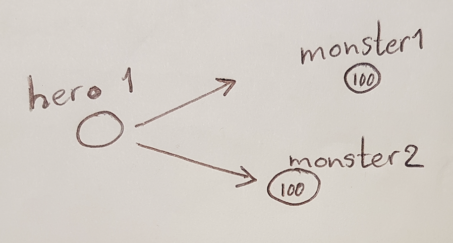
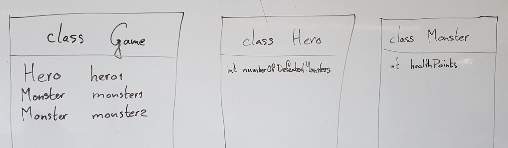
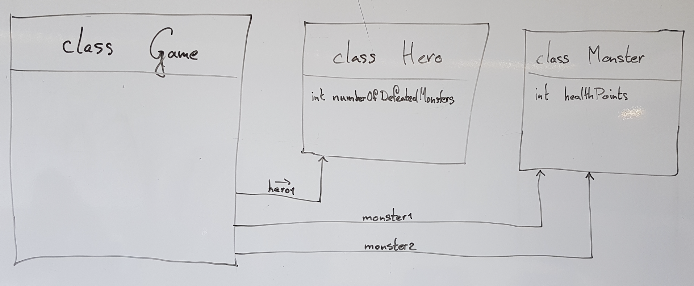

# Hoe programmeer je met objecten?

## Aan de hand van Hero tegen Monsters

Hoe groter software wordt, hoe tijdrovender het  testen en onderhouden.
Daarom wordt in de softwarewereld gezocht naar manieren om programma's onderhoudbaar te maken.
Een van de meer succesvolle manieren is het werken met *objecten*.
Een team dat een Computer Game maakt over een *hero* (held)
die tegen *monsters* vecht
zal liefst op één plek willen programmeren wat de eigenschappen
van de hero  zijn
en ook wat een monster is en wat je aan het monster kunt vragen.




Als er 2 monsters zijn worden er 2 *objecten* gemaakt,
als er 8 monsters zijn worden er 8 *objecten* gemaakt.
Elk van deze objecten representeert 1 monster.
De eigenschappen en het gedrag van een monster wordt geprogrammeerd in
een stuk van het programma dat we een `Class`
(klasse) noemen en dat (in dit voorbeeld)
de naam **Monster** krijgt.
Voorbeeld in C# (hoe je dit in Visual Studio kunt doen komt een stukje verder):

```cs
class Monster {
      ...
}
```

waarbij op de plaats van de puntjes de code voor deze `class` komt.
Voorbeeld in Java:

```cs
class Monster {
      ...
}
```

Voorbeeld in Swift:

```cs
class Monster {
      ...
}
```

Inderdaad, deze voorbeelden zijn hetzelfde.
Je zult merken dat er echt wel verschillen zijn hoe je in de ene of de andere taal een `class` noteert, maar in welke taal je ook zit:
*welke* `classes` je aanmaakt blijft hetzelfde!

<p class="note">In veel programmeertalen is afgesproken dat de naam van een `class` met een hoofdletter begint.</p>
Software Engineers bedenken in het begin van een project
welke `objecten` er nodig zijn en daaruit volgt
welke `classes` er geprogrammeerd gaan worden.
Dit kun je grotendeels bedenken zonder te weten in welke taal
de software gebouwd gaat worden.
Je kunt dat enigszins vergelijken met het bouwen van een huis:
Waar de muren, ramen en deuren komen (de structuur) kun je tot zekere hoogte
bedenken en tekenen zonder te weten of het huis met bakstenen,
van beton of van hout gebouwd gaat worden.
Een `object` kan bepaalde eigenschappen hebben.
Zo zal elk Monster in eerste instantie helemaal gezond zijn.
Als de *hero* hem aanvalt zal het *monster*
moe worden of gewond raken en
uiteindelijk wellicht bezwijken.


### Hoe maak ik een class aan in Visual Studio?

Klik met rechtermuisknop op het project en kies `Add Item`,
kies daarna een `class`. Onderin het scherm kun je de gewenste
`class name` aangeven (`file name` is `class name` met
`extensie` *.cs*) en dan op de *OK*-knop.

In veel programmeertalen is het gebruikelijk om elke `class` in een eigen file
te programmeren. 


## Gezondheid

In dit spel kunnen we dat realiseren
door het monster *hitPoints* te geven:
Voor een pas *aangemaakt* monster staat dit op 100,
bij verwondingen wordt dit gehele getal steeds kleiner,
bij 0 valt het monster verslagen neer.
Een waarde als *hitPoints* die elk `object`
van een bepaald `type` met zich meedraagt
noemen we een `Field`
We maken hiertoe in Monster een `field` *levenspunten* aan.

```cs
class Monster {
  int hitPoints = 100;
}
```

Hiermee is bepaald dat **elk** monster *hitPoints* heeft.
De waarde van dat getal kan per *monster object* verschillen:
*Monster 1*  kan nog op 100 staan terwijl *monster 2* misschien
nog maar 13 over heeft.

De code die in een `class` staat wordt gedeeld met alle `objecten`
van die `class` (meestal zeggen we: alle `objecten` van dat `type`,
want een `class` is een manier om een `type` te definiëren).
Om een `object` van `class` *Monster* aan te maken:
C# of Java:

```cs
new Monster()
```

(we zeggen dan ook wel dat er gebruik gemaakt wordt van de *new* `operator`)
Hiermee wordt ergens in het geheugen een `object`
van `type` *Monster* aangemaakt, we hebben echter géén manier
om naar dat `object` te *verwijzen* (*refereren*).
Vergelijk het met een ballon met gas: zolang je
het touwtje hebt (de referentie naar de balon) kun je bij de ballon,
maar als je het touwtje loslaat kun je niet meer bij de ballon komen.
Zo'n *referentie* kunnen we opslaan in een `Field`
(ook wel een variabele genoemd)
en dat `Field` moet ergens in een `class` zitten:
We maken hiervoor een *Game*-`object` aan dat
de referenties naar alle *heroes* en *monsters* bevat.
De code van het *Game* `object` komt in de `class` Game te staan.




In `class` Hero is een `Field`

```cs
int numberDefeatedMonsters = 0;
```
aangemaakt. De held wil namelijk graag dat de hele wereld weet hoeveel
monsters er door hem/haar verslagen zijn.
De `Class` *Game* heeft referenties naar 1 *hero* en
2 monsters (*monster 1* en *monster 2*) en aan het ervoor vermelde
`type` (dat zijn de `class` namen) kun je zien dat
de *hero* zich gedraagt zoals in `class` 'Hero' geprogrammeerd is,
terwijl de beide monsters zich gedragen volgens de code in `class` Monster.

```cs
public Game()
 {
     Hero hero = new Hero();
     Monster monster1 = new Monster();
     Monster monster2 = new Monster();
 }
```

## Attack
Onze *hero* staat te popelen om een monster te gaan aanvallen.
Hiervoor gaan we *gedrag* in de `class` *Hero* programmeren:

Dit wil zeggen dat je op een `object` van `type` *Hero*
een *method* kunt aanroepen die *Attack* heet.
Verder vertel je **welk** monster aangevallen wordt en
hoeveel *schade* (*damage*)
hierbij toegebracht wordt aan het monster (dus hoeveel er van de
*hitPoints* punten van het monster af gaan).
Als de method *Attack* op een *Held* `object` aangeroepen wordt
wordt de code van die methode uitgevoerd.

De held roept dan van het tussen haakjes genoemde monster de method *LooseHealth*
aan. Nu gaan we coderen hoe die method
er uit kan zien: daartoe programmeren we de method
*Attack* in de `class` *Hero* 

```cs
void Attack(Monster monster, int damage)
{
  monster.LooseHealth(damage);
}
```

ofwel: als op een `object` van type *Hero* (want in die class staat deze code)
de method *Attack* wordt aangeroepen (met als parameters tussen haakjes
aangegeven **welk** monster en hoeveel damage)
roept die de method *LooseHealth*
aan van het aangegeven monster. De binnengekomen info
over hoeveelheid *damage* wordt doorgegeven. 
In de method worden 2 zogenaamde parameters gebruikt, namelijk
*monster* van het `type` *Monster* en
*damage* van het `type` *int* (tussen haakjes te vinden na
de methode naam).
Het woord `void` wil zeggen dat er geen waarde wordt teruggegeven door de methode,
Er kan ook in plaats van `void` een zogenaamd `return type` staan dat aangeeft
wat voor soort waarde er terug gegeven wordt.

In `class` *Monster* moet vervolgens de `method` *LooseHealth*
gecodeerd worden:

```cs
void LooseHealth(int damage)
{
    this.hitPoints = this.hitPoints - damage;
}
```

Uitleg:
- Wederom begint het met *void* omdat de methode niks teruggeeft.
- Dan de methodenaam *LooseHealth*.
- Tussen de haakjes de ene parameter, genaamd *damage* en van type *int*.
- Tussen de accolades of *curly brackets* ('{' en '}') staat een assignment:
  - Een assignment is te herkennen aan het =-teken (spreek uit als **wordt**).
  - Rechts van de = staat een *expressie*, zeg maar een berekening, die uitgerekend (geëvalueerd) wordt. In dit geval: `this.hitPoints - damage`.
  - Het woord *this* geeft aan dat er iets gedaan wordt met het *object* waar we nu 'in' zitten: het specifieke monster dus dat werd aangevallen en dat dus als parameter aan method *Attack* werd meegegeven. In methode *Attack* zie je dat van *DAT* specifieke monster de methode *LooseHealth* wordt aangeroepen.
  - *Evaluatie* (berekening) van *this.hitPoints* geeft het *hitPoints*-getal van dat monster.
  - De '`- damage`' zorgt dat de meegegeven waarde van de parameter hier vanaf getrokken wordt.
  - De waarde van *this.hitPoints* (links van de =) wordt de uitkomst van de berekening.


### Constructie van een object
Net zoals we bij een methode aanvullende informatie mee kunnen
geven in de vorm van `parameters` kunnen we dat bij het aanmaken
van een nieuw `object` ook. Hiertoe gebruiken we een `constructor`:
Een `constructor` ziet er ongeveer uit als een methode:

```cs
Monster(int initialHealth)
{
  this.hitPoints = initialHealth;
}
```

Een `constructor` herken je alsvolgt:
- De constructor lijkt heel erg op een normale methode, maar...
- Er wordt geen `return-type` (of `void`) vermeld.
- De naam (*Monster* in dit geval) is gelijk aan de naam van de `class`.

### Constructor in Visual Studio

Je kunt natuurlijk de code hierboven zelf intypen (tussen de accolades van de `class`)
maar als je op die plek intypt *ctor* en dan 2x op *tab* drukt
doet Visual Studio een deel van het werk voor je.
Als we nu `new Monster(125)` aanroepen vanuit code wordt er een object
van type *Monster* geconstrueerd en daarvoor staat na constructie
de *hitPoints*-waarde op het meegegeven getal, 125 dus in dit geval.
Bij een `constructor` kunnen (net als bij een *normale* methode) ook
meerdere parameters meegegeven worden.


## Wat hebben we nu?

We hebben nu een basis neergezet voor een spel waarin een *hero* *monsters* kan aanvallen.

### Om het werkend te krijgen

Later wordt nog uitgelegd waarom, maar onthoudt vast dat we elk *Field* `private` maken.
`Methods` en `classes` mogen `public` zijn.

### Code tot nu toe

Voor de volledigheid volgt nu de code van de classes zoals die tot hier beschreven is.
Allereerst de `class` *Game*

```cs
namespace HereComeTheMonsters
{
    public class Game
    {
        public Game()
        {
            Hero hero = new Hero();
            Monster monster1 = new Monster(125);
            Monster monster2 = new Monster(100);
        }
    }
}
```

dan `class` *Hero*
```cs
namespace HereComeTheMonsters
{
    public class Hero
    {

        public Hero()
        {
        }


        public void Attack(Monster monster, int damage)
        {
            monster.LooseHealth(damage);
        }

    }
}
```

en tot slot `class` *Monster*

```cs
namespace HereComeTheMonsters
{
    public class Monster
    {

        private int hitPoints = 100;


        public Monster(int initialHealth)
        {
            this.hitPoints = initialHealth;
        }


        public void LooseHealth(int damage)
        {
            this.hitPoints = this.hitPoints - damage;
        }


    }
}
```
