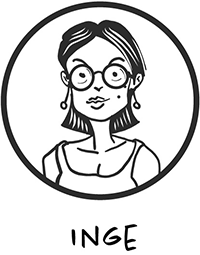

# Inge, intermediate

Waar 'Inge' staat mag naar eigen behoefte ook 'Ivo' gelezen worden en waar 'zij' staat mag ook 'hij' gelezen worden. 

Inge heeft al programmeerervaring. Misschien heeft ze al *methods* gemaakt, misschien nog niet, of bijna niet. We duiken er dan ook meteen in om daar achter te komen, daarna van daaruit verder te werken. 

Hieronder een aantal fasen of stappen die Inga kan  doorlopen. Een Stap zou ongeveer 1 dag werk kunnen zijn voor een gemiddelde student. 

Deze opdrachten vind je in de [Toolkit basis](../basic) in de categorieën 'Variabelen, 

## Stap 1

-   Wat is een method, hoe werk ik met returnvalues en hoe kan ik parameters gebruiken?

Hierover vind ik een opdracht in de  [Toolkit basis](../basic): 
+ Method marathon. 

---

## Stap 2

-   Methods (herhaling/uitbreiding)
-   Wat kan ik met Collections (met name List en Array in C#)?

Ook hierover vind je opdrachten in de  [Toolkit basis](../basic): 
+ Christmas tree generator

---

## Stap 3

+ Combineer verschillende zaken in grotere apps (dat noemen we een ***Wedstrijd***-app). 
+ Probeer ook eens voordat je begint met coderen om op te schrijven WAT een app moet gaan doen en HOE. 

In de  [Toolkit basis](../basic) staan (onder andere onder 'Integrale Opdrachten', maar ook bij 'Vingeroefening, Training, Challenge') ideeën voor wedstrijd-apps. Ook mag je zelf wat verzinnen! Het gaat er om dat je grotere apps maakt waarin je veelvuldig methods maakt, loops gebruikt, collecties, ... , hoe meer hoe beter!!  Succes en veel plezier. 

