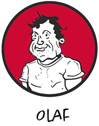

# Intro personas

In den beginne... had nog niemand programmeerervaring... Op het moment dat je aan dit semester begint heb je misschien al ergens ervaring opgedaan, of wellicht niet. Kortom: we zijn allen gelijk in dat we allemaal uniek zijn! 

Als je al ervaring hebt is het jammer helemaal aan het begin te beginnen. Vandaar dat we verschillende persona's beschreven hebben. Bepaal welke het best bij je past en kijk eens wat er over jouw persona gezegd wordt. 

| [Bas (of Barbara)  the Absolute Beginner](Bas.md)  | [Intermediate Inge (of Ivo)](Inge.md) | [OOP-experienced  Olaf (of Olivia)](Olaf.md) |
| ------------- | ------------- | ------------- |
|  | ||