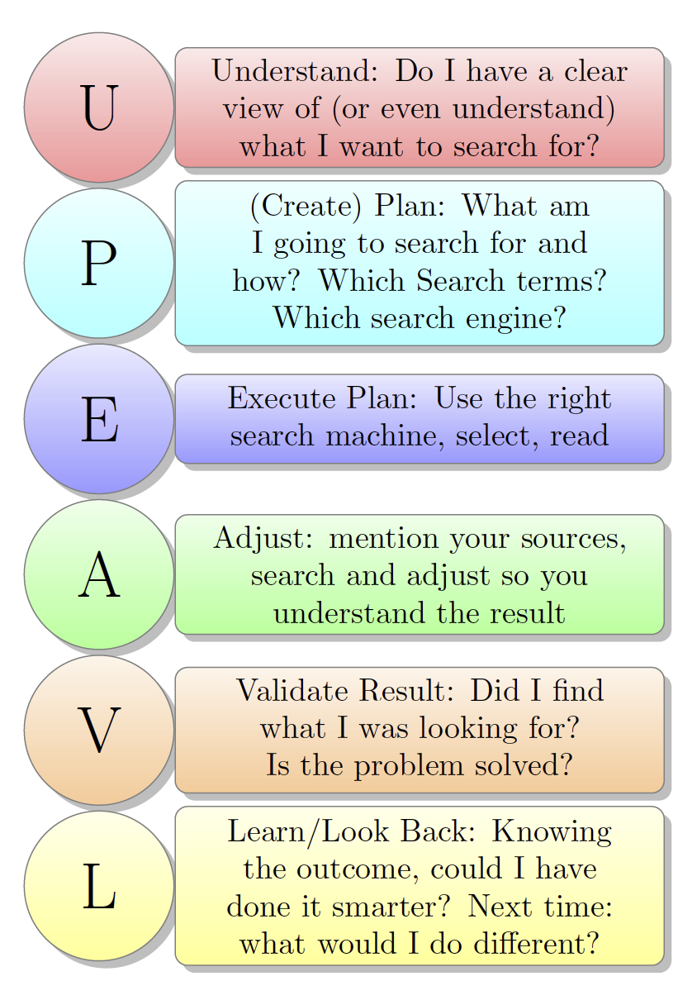

# How to solve a programmer/programming problem

Zie
[figuur Programmer Search Scheme]().
Vanwege het hoge ezelsbrug-gehalte is ervoor gekozen
de termen en de afkorting (UPEAVL) in het Engels te houden.
Hieronder een bespreking *per stap*.

### Understand
To solve a problem you must first Understand what the problem is!
- What is my starting point? An error? An exception? A bug? A feature on a wishlist?
- Snap ik het probleem waarvoor ik een oplossing zoek?
- Ken ik alle relevante begrippen?

### (Create) Plan
Maak een plannetje:
- Waar ga ik naar zoeken?
- Hoe?
- Welke zoektermen?
- Welke zoekmachine?

### Execute Plan
Voer plan uit:
- Gebruik de zoekmachine volgens plan.
- Selecteer en lees.

### Adjust
- Vernoem je bronnen.
- Pas aan zodat je het resultaat snapt.

### Validate Result
Controleer het resultaat:
- Heb ik gevonden wat ik zocht?
- Is het probleem hiermee opgelost?
- Is de oplossing (altijd) correct of zijn er gevallen waar het niet voor werkt?

### Learn/Look back
Leer:
- Wat heb ik geleerd?
- Nu je een antwoord kent: had je dit sneller, makkelijker, eleganter kunnen vinden? Heb je op het goeie gezocht?
- Stel ik kom nog een keer een vergelijkbaar probleem tegen, kan ik dan sneller tot een oplossing komen?
- Moet ik iets ervan vastleggen? Zoja, waar?

Op
[https://i889241.iris.fhict.nl/search/ProgrammerSearchScheme.pdf](https://i889241.iris.fhict.nl/search/ProgrammerSearchScheme.pdf)
is een wat uitgebreider document te vinden met voorbeeld.
Het idee komt in essentie van *How to solve it?* van de didacticus *Polya*.
Het is begonnen als zogenaamd 100-uren-onderzoek van Coen bij FHICT.
Veel collega's hebben feedback gegeven om te ont-wikkelen en beter te maken.
Hierbij werden ook een aantal alternatieven genoemd, zoals
#### bronnen
[http://www.rba.co.uk/wordpress/2016/09/19/essential-non-google-search-tools-for-researchers-top-tips/](http://www.rba.co.uk/wordpress/2016/09/19/essential-non-google-search-tools-for-researchers-top-tips/)
[https://decorrespondent.nl/5972/juist-nu-je-alles-kunt-googelen-moet-onderwijs-over-kennis-gaan/759327061724-15e0e58d](https://decorrespondent.nl/5972/juist-nu-je-alles-kunt-googelen-moet-onderwijs-over-kennis-gaan/759327061724-15e0e58d)
[https://en.wikipedia.org/wiki/Comparison_of_web_search_engines](https://en.wikipedia.org/wiki/Comparison_of_web_search_engines)
[https://www.ghacks.net/2016/09/09/duckduckgo-programmers-search-engine/](https://www.ghacks.net/2016/09/09/duckduckgo-programmers-search-engine/)
[http://html.com/blog/specialty-search-engines/](http://html.com/blog/specialty-search-engines/)
[http://www.academia.edu/34290333/Kritisch_zoeken_denken_en_evalueren_informatievaardigheden_als_21st_century_skill](http://www.academia.edu/34290333/Kritisch_zoeken_denken_en_evalueren_informatievaardigheden_als_21st_century_skill)
[http://bit.ly/MixedExtras](http://bit.ly/MixedExtras)
