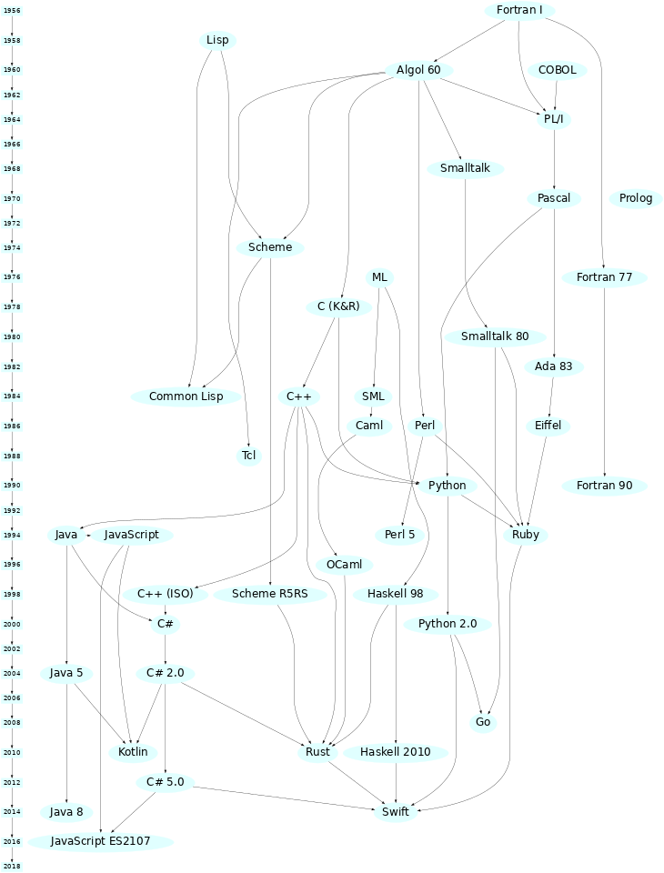

# OOP in diverse talen

## Inleiding
Er zijn een aantal concepten die algemeen gezien worden als definiërend voor Object Oriented ontwikkelen. Deze begrippen komen in veel OOP languages voor, maar worden in verschillende talen net wat anders genoteerd (andere syntax).

+ De concepten `class` en  `object`/`instance`.
+ `constructor` (of `initializer`, `instance creating`, `new`)
+ `Encapsulation` (`properties`, `accessors`, `private`)
+ `static` methods, fields en properties.
+ `interface` (`protocol`, `abstract base class`)(dus NIET als in: User Interface!)
+ `inheritance` (sub class, super class, base class, derived class).
+ Kun je er nog meer verzinnen of vindwen internet?

Aantal talen die interessant zijn om te bekijken omdat er een redelijk kans is dat je ze tegen gaat komen:
+ Java (C# en Java liggen dicht bij elkaar (hoe komt dat?)).
+ Kotlin: Android.
+ Swift: iOS.
+ Python:  (Applied Data Science; Infra semester 2).
+ C++ : bedacht om OOP mogelijk te maken in (een uitbreiding op) C. C++ is net als C gericht op performance.
+ ... of ben je geïnteresseerd in een andere taal...

## De opdracht

Kies een taal uit die jou interessant lijkt en ga op internet zoeken hoe de OOP-concepten in die taal geïmplementeerd zijn.
Is er een student of docent die een taal al kent?

+ Kun je alle concepten terugvinden? Zo nee, bestaan ze wel in die taal? Waarom niet? Hebben ze een andere oplossing?
+ Lijkt het op wat je gewend bent? Misschien lijkt het handiger? Elegante syntax? Of juist minder leesbaar?
+ Is de taal 'van huis uit' bedoeld voor OOP of lijkt het er later 'aan vastgeplakt' te zijn?
+ Neem een programma dat je eerder geprogrammeerd hebt en bedenk hoe anders het zou worden in deze taal. Leesbaarder? Korter?
+ Er komen vast nog andere vragen boven als je er  mee bezig bent.

## Bronnen

+ [https://en.wikipedia.org/wiki/Generational_list_of_programming_languages](https://en.wikipedia.org/wiki/Generational_list_of_programming_languages)
+ [https://www.quora.com/Which-are-the-major-programming-language-families?share=1](https://www.quora.com/Which-are-the-major-programming-language-families?share=1)
+ [http://www.martinrinehart.com/pages/genealogy-programming-languages.html](http://www.martinrinehart.com/pages/genealogy-programming-languages.html)
+ [http://rigaux.org/language-study/diagram.html](http://rigaux.org/language-study/diagram.html)
