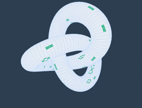

# Workshop Conway's Game of Life

Kijk ter introductie de uitleg wat the Game of Life is:
[https://www.youtube.com/watch?v=ouipbDkwHWA](https://www.youtube.com/watch?v=ouipbDkwHWA)

Professor John Conway, de ontwikkelaar van de Game of Life, is in april 2020 gestorven aan Covid-19.

Hoewel de regels heel simpel zijn kun je er complexe dingen mee bouwen.

Als je echt los wilt gaan kan dat natuurlijk.

In de workshop kijken we naar een simpele variant:
1-dimensionaal.

De omschrijving:
`The evolution rule is based on a five-cell neighborhood, YYXYY, where the next generation of the center cell X depends on its own state and those of the four Y cells. The rule is: (1) a cell is born if it has 2 or 3 Y-neighbors alive, and (2) a living cell survives if it has 2 or 4 Y-neighbors.`

Gegeven een array of string van bits kunnen we een volgende generatie berekenen.

Regels:
- buren: 2 cellen links en 2 rechts van huidige positie.
- 0 wordt 1 als er 2 of 3 buren 1 zijn, blijft 0 anders.
- 1 blijft 1 als er 2 of 4 buren 1 zijn, wordt 0 anders.

Beginnend met de string:
'000000010111111000000', krijgen we als volgende generatie:
'000000001001101100000', daarna wordt het:
'000000000110101010000', dan
'000000001011111100000' en zo voort.

Het ziet er wat leuker uit als je bijvoorbeeld met spatie en 'X' werkt:
"       X XXXXXX      "
"        X  XX XX     "
"         XX X X X    "
"        X XXXXXX     "
"         X  XX XX    "
"          XX X X X   "
"         X XXXXXX    "
"          X  XX XX   "
"           XX X X X  "
"          X XXXXXX   "
Je ziet dat hier een opschuivend maar herhalend patroon in ontstaat.

## De opdracht
Maak een programma dat gegeven een input de volgende generaties berekent en die onder elkaar op het scherm zet, zoals hierboven gebeurde.

Als dat gelukt is en je hebt de smaak te pakken kun je proberen een eigen variatie te verzinnen op de regels, of je gaat voor de 'echte' Game of Life met een 2d array!

## Bronnen

+ [conwaylife.com](https://conwaylife.com/)

+ [LifeWiki](https://conwaylife.com/wiki/Main_Page)

+ [Numberphile: Inventing the Game of Life](https://www.youtube.com/watch?v=ouipbDkwHWAf)

+ [Princeton announces that Conway died](https://www.princeton.edu/news/2020/04/14/mathematician-john-horton-conway-magical-genius-known-inventing-game-life-dies-age)

+ [Conway's lesser known results](https://mathoverflow.net/questions/357197/conways-lesser-known-results?utm_source=Iterable&utm_medium=email&utm_campaign=the_overflow_newsletter&utm_content=4-22-20)

+ [wiki:Conway](https://en.wikipedia.org/wiki/Conway%27s_Game_of_Life)

+ [Coding Challenge #85: The Game of Life](https://www.youtube.com/watch?v=ouipbDkwHWAf)

+ [wikimedia](https://commons.wikimedia.org/wiki/Category:Animations_of_the_Game_of_Life)
